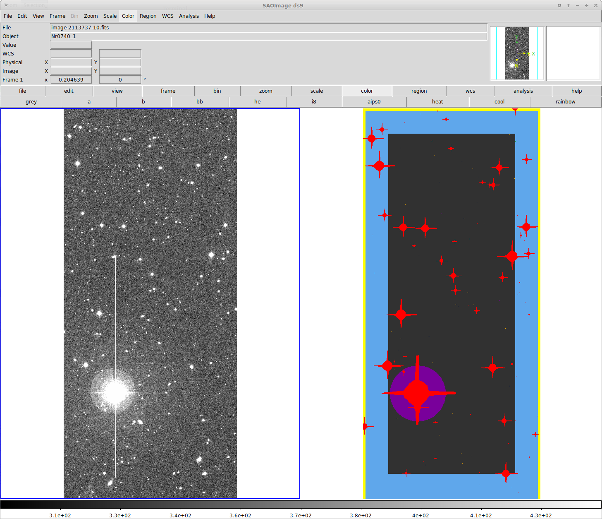
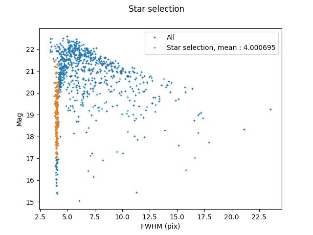
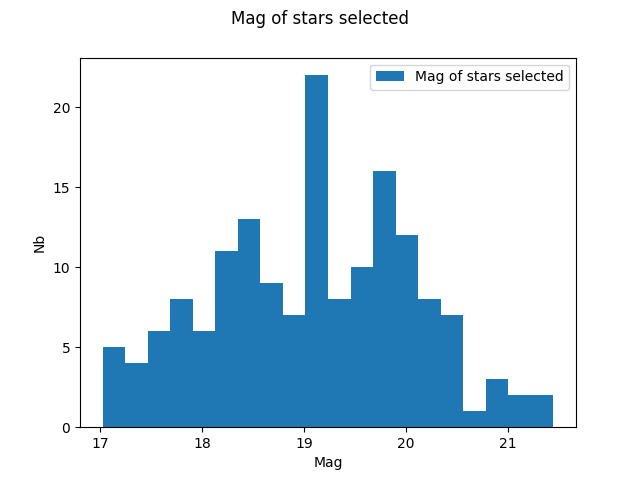
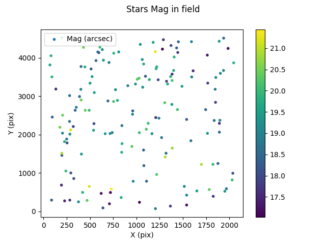
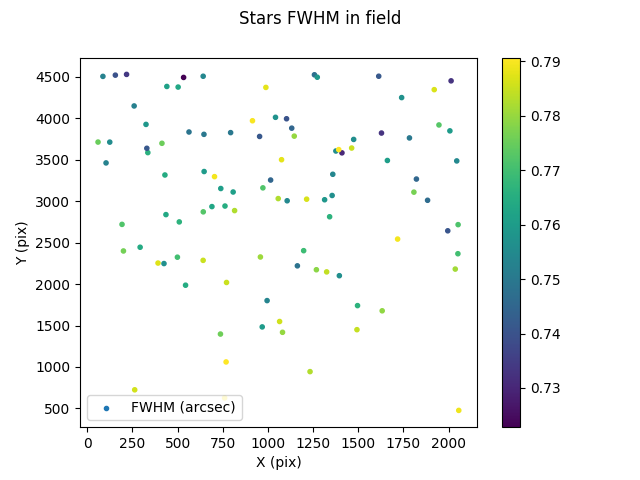

# ShapePipe tutorial

## Index

1. [Introduction](#introduction)
    1. [File types and names](#file-types-and-names)
    1. [CFIS processing](#cfis-processing)
    1. [Running the pipeline](#running-the-pipeline)
1. [Prepare input images](#prepare-input-images)
    1. [Select Field and images](#select-field-and-images)
    1. [Create pipeline-compatible file names](#create-pipeline-compatible-file-names)
1. [Process single exposure images](#process-single-exposure-images)
    1. [Split images](#split-images)
    1. [Merge WCS headers](#merge-wcs-headers)
    1. [Mask images](#mask-images)
    1. [Extract sources](#extract-sources)
    1. [Select stars](#select-stars)
    1. [Model the PSF](#model-the-psf)
    1. [Validation tests](#Validation tests)
    1. [Full run config file](#Full-run-config-file)
1. [Stacks processing](#Stack-processing)
    1. [Masking stacked images](#Masking-stacked-images)
    1. [Source identification stacked images](#Source-identification-stacked-images)
    1. [PSF interpolation](#PSF-interpolation)
    1. [Prepare spread-model](#Prepare-spread-model)
    1. [Spread-Model](#Spread-Model)
    1. [Prepare shape measurement](#Prepare-shape-measurement)
    1. [NGMIX : Shape measurement](#NGMIX-:-Shape measurement)
    1. [Make final catalog](#Make-final-catalog)

## Introduction

The `ShapePipe` pipeline can process single-exposures images, and stacked images. The input images have to be calibrated beforehand for astrometry and photometry.

***WARNING /!\ :*** All file paths for the following examples are relative. When running on a cluster, you need to make sure that these paths are accessible on all computing nodes.
Absolute paths are recommended to avoid problems.

### File types and names

The `ShapePipe` pipeline handles different image and file types, some of which
are created by the pipeline during the analysis. These file types are listed below. All 
files follow a (configurable) naming and numbering convention, to facilitate bookkeeping for
tracking relevant image information. We adopt a numbering schemes as follows.

- Single-exposure mosaic image.  
  Multi-HDU FITS file containing a mosaic from multiple CCDs of a single exposure (an exposure is also called epoch).
  Each CCD is stored in a different HDU.
  These files are used on input by `ShapePipe`. The pixel data can contain the observed image, a weight map, or a flag map.
  These images are typically created by a telescope analysis software (e.g.~`pitcairn`).  
  Convention: None. The file names are in general determined by this software, e.g.~they contain the run ID. and do not
  need to be changed to be read by `ShapePipe`.  
  Examples from CFIS: `2228303p.fits`, `2214439p.flag.fits`.

- Single-exposure single-CCD image.  
  FITS file containing a single CCD from an individual exposure. The pixel data can contain the observed image, a weight map, or a flag map.  
  Default convention: **<image_type>-<exposure_name>-<CCD_number>.fits**  
  Examples: `image-2079614-9.fits`, `weight-2079614-3.fits`

- Stacked images  
  FITS file containing a stack by co-adding different single exposures, created by software such as `swarp`.
  A stacked image is also called *tile*. 
  The pixel data can contain the observed image, a weight map, or a flag map.  
  Default convention: **<image_type>-<number>.fits**  
  Examples: `CFIS_image-51.fits`, `pipeline_flag-2134.fits`

### CFIS processing

`ShapePipe' splits the processing of CFIS images into three parts: 1.) Preparation of the input images; 2.) Processing of single exposure images;
3.) Processing of stacked images. The single exposures are first split into single-CCD images, which are processed in turn and
independently.

The preparation of input images is done before running the actual pipeline, using auxilliary scripts.

The processing of single exposure images contains the following steps:
  * Split exposure into single-exposure single-CCD images
  * Create masks for bright stars, spikes, borders, Messier objects, ...
  * Detect stars
  * Model the PSF
  * Validate the PSF model (optional)

The processing of stacked images has the following tasks:
  * Create mask for bright stars, spikes, border, Messier objects, ...
  * Detect all sources
  * Interpolate the PSF model at the location of each source for all contributing exposures
  * Create postage stamps necessary for the *spread model*, for galaxy selection
  * Compute the spread model for each source
  * Create postage stamps, for the shape measurement
  * Measure galaxy shapes
  * Merge all results into one parent catalog

The following flowchart visualised these processes:


In the following, the individual processing steps are described in detail.

### Running the pipeline

See the main `ShapePipe` readme for more details.

In the following, to have consistent paths, we assume the existence of the following directories or links:

- `~/ShapePipe`: Installation path of the pipeline. E.g. point to the directory cloned from `github`.  
- `~/ShapePipeRun`: Run path of the pipeline. Go here to run the pipeline modules.
  - `~/ShapePipeRun/output`: Output directory, to be created by the user before running the pipeline.   
- `CFIS`: Path of downloaded CFIS images.  

In `~/ShapePipeRun` the following subdirectories need to be created by the user:
- `~/ShapePipeRun/input_tiles`: Symbolic links to CFIS input tile images and weight files
- `~/ShapePipeRun/input_exposures`: Symbolic links to CFIS single-exposure images, weights, and flag file
- `~/ShapePipeRun/output`: General output generated by the pipeline (log files,
  diagnostics, statistics, output images, catalogues)
- `~/ShapePipeRun/output_headers`: Single-exposure headers with WCS information`
- `~/ShapePipeRun/output_star_cat`: Star catalogues

In general, a call to the pipeline is done as follows:

```bash
cd ~/ShapePipeRun
~/ShapePipe/shapepipe_run.py -c ~/ShapePipe/example/GOLD/config_<module[s]>.ini
```

The config file `config_<module[s]>.ini` contains the configuration for one or more modules.


## Prepare input images

### Select field and images

The selection of images on input can be done in the config files of the relevant modules, by specifying input
path(s) and input file name patterns. Thus, a sub-selection of images in a given input directory can be made.
However, one might want to pre-select specific images before the pipeline is run, for example to find all available images (exposures
and stacks) in a given sky area. The resulting files can then be copied to a new, dedicated directory (or alternatively linked
using symbolic links), or downloaded to a local machine.

There are two options to find images. 

#### Option a.

With the script `cfis_field_select.py`.

First, find the tile(s) covering a given coordinate or area. For example, the tile for a Planck cluster at R.A.=255.66 deg, dec= 34.05 deg
can be found with the `--coord` option:
```bash
~/ShapePipe/scripts/python/cfis_field_select.py -i ~/CFIS/tiles+weights_DR2.txt --coord 255.66deg_34.05deg -v -t tile
```
The input text file (with `-i`) contains a list of CFIS tiles.

We also need to get the weight files for the tile. 
```bash
cfis_field_select.py -i ~/CFIS/tiles+weights_DR2.txt --coord 255.66deg_34.05deg -v -t weight
```

Once the resulting tiles and weight images are downloaded, we need to get the exposure images that where co-added to produce the tiles.
These can be found from the tile header, with the `--tile` option. We need all three single-exposure types, data, weights, and flags:
```bash
~/ShapePipe/scripts/python/cfis_field_select.py -i ~/CFIS --tile -v -t exposure
~/ShapePipe/scripts/python/cfis_field_select.py -i ~/CFIS --tile -v -t exposure_weight.fz
~/ShapePipe/scripts/python/cfis_field_select.py -i ~/CFIS --tile -v -t exposure_flag.fz
```

The resulting files need to be downloaded.

#### Option b.

With the pipeline module `select_data.py`.

### Create pipeline-compatible file names

The original CFIS image names cannot be digested by the pipeline. To create compatible names, and unique tile numbers,
symbolic links with the appropriate names can be created as follows:
```bash
mkdir input_tiles
mkdir input_exposures
~/ShapePipe/scripts/python/cfis_create_image_links.py -i ~/CFIS -o input_tiles -v -t tile --image_base_new CFIS_image --weight_base_nw CFIS_weight
~/ShapePipe/scripts/python/cfis_create_image_links.py -i ~/CFIS -o input_exposures -v -t exposure
```
Note that existing links in the output directories (with option `-o`) will cause the script to abort with an error.

These commands create links with the default naming convention (see above), and that remove dots in the file name that do not indicate the file extension.


## 2.) Process single exposure images

### Split images

**Module:** split_exp_runner   
**Input:** single-exposure images, weights, flags  
**Output:** single_exposure single-CCD files for input images, weights, flags

The first step of single-exposure processing is to split the single-exposures images into
files that contain one CCD each.

The example config file is `~/ShapePipe/example/GOLD/config_split_exp.ini`.
On input, we need to specify the three input types (exposures, weights, flags),
and their extensions. This happens in the `[FILE]` section:
```ini
[FILE]
FILE_PATTERN = image,weight,flag
FILE_EXT = .fitsfz,.fitsfz,.fitsfz
```
On output, the same three file types are required. The number of MegaCAM CCDs is 40:
```ini
[SPLIT_EXP_RUNNER]
OUTPUT_SUFFIX = image,weight,flag
N_HDU = 40
```

Run
```bash
mkdir -p output
~/ShapePipe/shapepipe_run.py -c ~/ShapePipe/example/GOLD/config_split_exp.ini
```

On success, files accordingt to the three output types are created.

### Merge WCS headers

**Module:** merge_headers  
**Input:** single-exposure single_CCD images, weights, flags (output of `split_exp`)  
**Output:** Single SQL file with combined header information  

This pipeline module saves the WCS information (image
transformation and distortions, computed during astrometrical calibration)
for each CCD. At the end, this information has to be merged back into a single file.  
Specify the output path:
```ini
[MERGE_HEADER_RUNNER]
OUTPUT_PATH = $HOME/ShapePipeRun/output_headers
```
Create the output directory, and run the pipeline:

```bash
mkdir -p output_headers
~/ShapePipe/shapepipe_run.py -c ~/ShapePipe/example/GOLD/config_merge_headers.ini
```
Since this produces a single output file
instead of a file per input image, it is more convenient to have this file in
a separated directory for later use.

On success, a single `.sqlite` file is created.

### Mask images

**Module:** mask_runner   
**Input:** single-exposure single-CCD images, weights, flags [, star_cat]  
**Output**: single-exposure single-CCD flag files

This module creates masks for bright stars, diffraction spikes, Messier objects,
borders, and other artifacts. It joins the newly created mask with the already
existing masks (from the input flag files) of  cosmic rays and various artifacts.  

Those mask parameters are read from a second config file, whose path
needs to be specified:
```ini
[MASK_RUNNER]
MASK_CONFIG_PATH = $HOME/ShapePipe/example/GOLD/config.mask
```
In this mask config file the default parameters can be kept in the most part.
These parameters specify the mask properties for border, halos, spikes, Messier
objects, and external flag input (in our case provided from CFIS pre-processing).

It points to various default parameter files for the different mask types,
make sure that that paths are correct, in our case
`$HOME/ShapePipe/example/GOLD/mask_default/` in front of each file name.

To distinguish the newly created output flag files from the input ones,
a suffix is added:
```ini
SUFFIX = pipeline
```
Next, this module requires a star catalogue containing position and magnitude
of bright stars. By default this is automatically created by accessing online
star catalogues. Since in some cases computing nodes on clusters might not have
internet access, such a catalog can also be created for each image, before running 
this module as follows:
```bash
~/ShapePipe/scripts/python/create_star_cat.py input_exposures output exp
```
Then, the star catalogue needs to be specified as input in the config file,
and a flag has to be set::
```ini
[FILE]
INPUT_DIR = last:split_exp_runner,${HOME}/ShapePipeRun/output_star_cat
[MASK_RUNNER]
USE_EXT_STAR = True
```

If instad the star catalogues can be accessed during the pipeline running,
the config files looks as follows:
```ini
[FILE]
INPUT_DIR = last:split_exp
[MASK_RUNNER]
USE_EXT_STAR = False
```

Finally, run the module:
```bash
~/ShapePipe/shapepipe_run.py -c ~/ShapePipe/example/GOLD/config_mask.ini
```

On success, pipeline-flag files are created.

**Diagnostics:** Open a single-exposure single-CCD image and the corresponding pipeline flag
in `ds9`, and display both frames next to each other. Example
```bash
ds9 output/shapepipe_run_2020-03-03_15-31-00/split_exp_runner/output/image-2113737-10.fits output/shapepipe_run_2020-03-03_17-29-34/mask_runner/output/pipeline_flag-2113737-10.fits
```
Choose `zoom fit` for both frames, click `scale zscale` for the image, and `color aips0` for the flag, to display something like this:



By eye the correspondence between the different flag types and the image can be
seen. Note that the two frames might not match perfectly, since (a) WCS
information is not available in the flag file FITS headers; (b) the image can
have a zero-padded pixel border, which is not accounted for by `ds9`.

### Extract sources

**Module:** sextractor
**Input:** single-exp_single-CCD image, weights, flags
**Output:** sextractor catalogue

The purpose of source extraction/source identification on single exposures is
to select stars in the next step. Therefore, a relatively high 
detection threshold is chosen to avoid to detect too many low-SNR
artifacts, and to reduce the output catalogue size. The following config entry
is
```ini
DETECT_THRESH    2.             # <sigmas> or <threshold>,<ZP> in mag.arcsec-2
```
in the file `$HOME/ShapePipe/example/GOLD/sextractor_default/default.sex`.

On success, SEXtractor catalogue FITS files are produced.

### Select stars

**Module:** setools
**Input:** sextractor catalog
**Output:** masked sextractor catalogue

For the star selection we use the size-magnitude plane. We first find the
stellar locus, by computing the FWHM mode of all objects. Objects are selected
within some range in FWHM around the mode, and within a magnitude range.

The selection criteria are given in a selection configuration file, whose name is specified
in the `setools` section:
```ini
[SETOOLS_RUNNER]
SETOOLS_CONFIG_PATH = $HOME/ShapePipe/example/GOLD/star_selection.setools
```
The selection config file `star_selection.setools` first defined a pre-selectione (or filter, or mask),
such that the subsequent computation of the mode is more stable:
```ini
[MASK:preselect]
MAG_AUTO > 0
MAG_AUTO < 20
FWHM_IMAGE > 0.3 / 0.186
FWHM_IMAGE < 1.5 / 0.186
FLAGS == 0
IMAFLAGS_ISO == 0
NO_SAVE
```
> Note the normalisation by the pixel scale to express **FWHM_IMAGE** in arc seconds.

The star sample is then selected as follows:
```ini
[MASK:star_selection]
MAG_AUTO > 17.
MAG_AUTO < 21.5
# NOTE : unit is pixel
FWHM_IMAGE <= mode(FWHM_IMAGE{preselect}) + 0.2
FWHM_IMAGE >= mode(FWHM_IMAGE{preselect}) - 0.2
FLAGS == 0
IMAFLAGS_ISO == 0
```
In addition, the selection config file can contain instructions to create plots and
statistics of the selected population(s). The former can be scatter plots and histograms,
the former can include mean, mode, extrema, and standard deviation
of any quantity from the SExtractor input catalogue, the number of selected objects, etc.. 

On success, masked SEXtractor catalogues are created in `mask`, plots are put in `plots`,
and text files with the computed statistics in `stats`.

The following plots show an example, CCD #10 of exposure 2113737.


| Size-magnitude plot | Star magnitude histogram | Stars in CCD (mag) | Stars in CCD (size) |
| --- | --- | --- | --- |
|  |  |  |  | 
| The stellar locus is well-defined | Magnitude distribution looks reasonable | Stars are relatively homogeneously distributed over the CCD | The uniform and small seeing of CFHT is evident |

To contrast the last plot, here is the case of CCD #35 (lower right corner), which shows a known (but yet unexplained) lack of stars
in the lower parts:



The statistics output file, also for CCD #10 is:
```bash
(shapepipe)  dap ~/ShapePipeRun $ cat output/shapepipe_run_2020-03-05_10-00-26/setools_runner/output/stat/star_stat-2113737-10.txt 
# Statistics
Nb objects full cat = 1267
Nb stars = 160
stars/deg^2 = 6345.70450519073
Mean star fwhm selected (arcsec) = 0.7441293125152588
Standard deviation fwhm star selected (arcsec) = 0.014217643037438393
Mode fwhm used (arcsec) = 0.7345179691314697
Min fwhm cut (arcesec) = 0.7159179691314698
Max fwhm cut (arcsec) = 0.7531179691314697
```

### Model the PSF

**Module:** psfex
**Input:** setools_star_selection
**Output:** star catalogue, psf file 

The PSF modeling is done with `PSFEx`. The psfex module configuration section
has to point to the executable and the default psfex config file, which does not
need to be changed.
```ini
[PSFEX_RUNNER]
EXEC_PATH = psfex
DOT_PSFEX_FILE = ./example/test_psfex/default.psfex
```

On success, FITS files containing the star catalalogue (`psfex_cat-*.cat`) and the PSF at
the stars' positions (`star_selection-2159358-9.psf`) are created.

### Validation tests

**Module:** psfinterp
**Parent**: psfex, setools
**Input:** star catalogue, psfex_catalog
**Output:** star catalogue

The interpolation of the PSF is not done at this stage for the shape measurement. But, in order to make validation tests on the model we need the model at the position of the stars used. For that we run the module : `psfinterp_runner` on `VALIDATION` mode. Here is a commented example config file for the pipeline :

```ini
# Define the way psfexinter will run.
# CLASSIC for classical run.
# MULTI-EPOCH for multi epoch.
# VALIDATION for output allowing validation (only on single epoch !)
MODE = VALIDATION
# Column names of position parameters
POSITION_PARAMS = XWIN_IMAGE,YWIN_IMAGE
# If True, measure and store ellipticity of the PSF
GET_SHAPES = True
# Number minimal of stars require to interpolate the PSF on the CCD
STAR_THRESH = 20
# Maximum value allowed for the global chi2 of the model for the CCD
CHI2_THRESH = 2
```

On success, validation catalogues are created.

### Full run config file

Except for the spliting step, all the process can be done automatically. Here is an example config for the pipeline :

```ini
# ShapePipe Configuration File Example

## Default ShapePipe options
[DEFAULT]
# VERBOSE (optional) default is True, i.e. print everything
; VERBOSE = False
# RUN_NAME (optional) default is shapepipe_run
; RUN_NAME = my_shapepipe_run
# RUN_DATETIME (optional) default is True, i.e. add DATE and TIME to RUN_NAME
; RUN_DATETIME = False

## ShapePipe execution options
[EXECUTION]
# MODULE (required) must be a valid module runner name (or a comma separated list of names)
MODULE = mask_runner, sextractor_runner, setools_runner, psfex_runner, psfexinterp_runner
MODE = SMP

## ShapePipe file handling options
[FILE]
# LOG_NAME (optional) default is shapepipe
; LOG_NAME = my_shapepipe_log
# RUN_LOG_NAME (optional) default is shapepipe_runs
; RUN_LOG_NAME = my_shapepipe_run_log
# INPUT_DIR (required) must be a valid directory containing input files for the first module
INPUT_DIR = last:split_exp_runner,/path/to/external/star/catalos/directory
# OUTPUT_DIR (required) must be a valid directory to write the pipeline output files
# NOTE : In order to use the 'last' keyword point to the same directory as the one use for the spliting step
OUTPUT_DIR = /same/as/spliting/runner
# FILE_PATTERN (opional) list of string patterns to identify input files
FILE_PATTERN = image,weight,flag,star_cat
# FILE_EXT (opional) list of string extensions to identify input files
FILE_EXT = .fits,.fits,.fits,.cat
# NUMBERING_SCHEME (optional) string with numbering pattern for input files
NUMBERING_SCHEME = -0000000-0

## ShapePipe job handling options
[JOB]
# BATCH_SIZE (optional) default is 1, i.e. run all jobs in serial
SMP_BATCH_SIZE = 48
# TIMEOUT (optional) default is None, i.e. no timeout limit applied
# NOTE : the longest step is the PSF estimation (around 5 minutes)
TIMEOUT = 10:00:00

## Module options
[MASK_RUNNER]

MASK_CONFIG_PATH = ./example/test_all_exp/config.mask

USE_EXT_FLAG = True
USE_EXT_STAR = True

# Suffix for the output file. (OPTIONAL)
# ex : SUFFIX_flag_NUMBERING.fits or flag_NUMBERING.fits if not provided
SUFFIX = pipeline

[SEXTRACTOR_RUNNER]

ADD_INPUT_DIR = /path/to/spliting/run/shapepipe_date_hour/split_exp_runner/output
FILE_PATTERN = image,weight,pipeline_flag

EXEC_PATH = sex

DOT_SEX_FILE = ./example/test_all_exp/default.sex
DOT_PARAM_FILE = ./example/test_sex/default.param

WEIGHT_IMAGE = True
FLAG_IMAGE = True
PSF_FILE = False

#CHECKIMAGE can be a list of BACKGROUND, BACKGROUND_RMS,
#INIBACKGROUND, MINIBACK_RMS, -BACKGROUND,
#FILTERED, OBJECTS, -OBJECTS, SEGMENTATION, APERTURES
CHECKIMAGE = BACKGROUND

# Suffix for the output file. (OPTIONAL)
# ex : SUFFIX_sexcat_NUMBERING.fits or sexcat_NUMBERING.fits if not provided
SUFFIX = exp

MAKE_POST_PROCESS = False

[SETOOLS_RUNNER]

SETOOLS_CONFIG_PATH = ./example/test_all_exp/star_selection.setools

[PSFEX_RUNNER]

EXEC_PATH = psfex

DOT_PSFEX_FILE = ./example/test_psfex/default.psfex

#CHECKIMAGE can be a list of CHI,PROTOTYPES,SAMPLES,
#RESIDUALS,SNAPSHOTS, MOFFAT,-MOFFAT,-SYMMETRICAL or NONE
; CHECKIMAGE = RESIDUALS

[PSFEXINTERP_RUNNER]

FILE_PATTERN = star_selection,star_selection,psfex_cat
FILE_EXT = .psf,.fits,.cat

# Define the way psfexinter will run.
# CLASSIC for classical run.
# MULTI-EPOCH for multi epoch.
# VALIDATION for output allowing validation (only on single epoch !)
MODE = VALIDATION

GET_SHAPES = True

STAR_THRESH = 20
CHI2_THRESH = 2

# When running in multi-epoch those position has to be WCS !
POSITION_PARAMS = XWIN_IMAGE,YWIN_IMAGE
```

## Stacks processing

### Masking stacked images

**Module :** mask_runner   
**Module inputs :** tile_image, tile_weight, (star_cat)   
**Script :** create_star_cat.py

Here we will create masks for bright stars, spikes and borders. Since computing nodes on clusters don't usually have an internet access we will have to first create a star catalog for each images with the script : `create_star_cat.py`. To use it :

```bash
python create_star_cat.py path/to/image_dir path/to/script/output_dir
```

Once the star catalogs are created we can run the module.
Here is a commented example config file for the pipeline :
```ini
[MASK_RUNNER]

MASK_CONFIG_PATH = ./example/test_all_tile/config.mask

# If true will expect an external mask file
USE_EXT_FLAG = True

# If true will expect an external star catalog
USE_EXT_STAR = True

# Suffix for the output file. (OPTIONAL)
# ex : SUFFIX_flag_NUMBERING.fits or flag_NUMBERING.fits if not provided
SUFFIX = pipeline
```

Here is a commented example config file for the module :

```ini
[PROGRAM_PATH]

WW_PATH = ww
WW_CONFIG_FILE = ./example/test_mask/mask_default/default.ww

# If external star catalogs are provided comment the parameter bellow
#CDSCLIENT_PATH = findgsc2.2


[BORDER_PARAMETERS]

# NOTE : On the tiles it is not necessary to mask the borders
BORDER_MAKE = False

BORDER_WIDTH = 50
BORDER_FLAG_VALUE = 4


[HALO_PARAMETERS]

HALO_MAKE = True

HALO_MASKMODEL_PATH = ./example/test_mask/mask_default/halo_mask.reg
HALO_MAG_LIM = 13.
HALO_SCALE_FACTOR = 0.05
HALO_MAG_PIVOT = 13.8
HALO_FLAG_VALUE = 2
HALO_REG_FILE = halo.reg


[SPIKE_PARAMETERS]

SPIKE_MAKE = True

SPIKE_MASKMODEL_PATH = ./example/test_mask/mask_default/MEGAPRIME_star_i_13.8.reg
SPIKE_MAG_LIM = 18.
SPIKE_SCALE_FACTOR = 0.3
SPIKE_MAG_PIVOT = 13.8
SPIKE_FLAG_VALUE = 128
SPIKE_REG_FILE = spike.reg


[MESSIER_PARAMETERS]

MESSIER_MAKE = True

MESSIER_CAT_PATH = ./example/test_mask/mask_default/Messier_catalog_updated.npy
MESSIER_PIXEL_SCALE = 0.186
MESSIER_SIZE_PLUS = 0.
MESSIER_FLAG_VALUE = 16


[EXTERNAL_FLAG]

# We don't have any mask for the stacked images. Most artifacts are time dependent and remove during stacking (not entirely true..)
EF_MAKE = False


[MD_PARAMETERS]

MD_MAKE = False

MD_THRESH_FLAG = 0.3
MD_THRESH_REMOVE = 0.75
MD_REMOVE = False


[OTHER]

KEEP_REG_FILE = False
KEEP_INDIVIDUAL_MASK = False

# WARNING : at the end the directory is cleared entirely make sure there is no other important files in it.
TEMP_DIRECTORY = ./.temp2
```

### Source identification stacked images

**Module :** sextractor_runner   
**Module inputs :** tile_image, tile_weight, tile_flag

On the tiles we want to detect all the sources. For that we set a low detection threshold.  
Also, we run a post-processing step on each tiles to find all epochs contributing to each objects. Here is a commented example config file for the pipeline :

```ini
[SEXTRACTOR_RUNNER]

EXEC_PATH = sex

DOT_SEX_FILE = ./example/test_all_tile/default.sex
DOT_PARAM_FILE = ./example/test_sex/default.param

WEIGHT_IMAGE = True
FLAG_IMAGE = True
PSF_FILE = False

#CHECKIMAGE can be a list of BACKGROUND, BACKGROUND_RMS,
#INIBACKGROUND, MINIBACK_RMS, -BACKGROUND,
#FILTERED, OBJECTS, -OBJECTS, SEGMENTATION, APERTURES
; CHECKIMAGE = BACKGROUND

# Suffix for the output file. (OPTIONAL)
# ex : SUFFIX_sexcat_NUMBERING.fits or sexcat_NUMBERING.fits if not provided
SUFFIX = tile

#####################
# POST-PROCESS PART #
#####################
# This part only concern tiles. It will make the management of multi-epoch possible.

MAKE_POST_PROCESS = True

# Create with the split_exp_hdu module
LOG_WCS = /path/to/file/containing/WCS/information/log_exp_headers.npy

# World coordinate to use (those parameters has to be required as output of SExtractor)
WORLD_POSITION = XWIN_WORLD,YWIN_WORLD

# Size of one CCD in pixel
# x_min,x_max,y_min,y_max
# NOTE : For CFIS images the header keyword is 'DATASEC'
CCD_SIZE = 33,2080,1,4612
```

Here is a commented example config file for the module :

```text
#-------------------------------- Catalog ------------------------------------

CATALOG_TYPE     FITS_LDAC

PARAMETERS_NAME  /home/guinot/pipeline/ShapePipe/example/test_sex/default.param

#------------------------------- Extraction ----------------------------------

DETECT_TYPE      CCD            # CCD (linear) or PHOTO (with gamma correction)
DETECT_MINAREA   10              # min. # of pixels above threshold
DETECT_MAXAREA   0              # max. # of pixels above threshold (0=unlimited)
THRESH_TYPE      RELATIVE       # threshold type: RELATIVE (in sigmas)
                                # or ABSOLUTE (in ADUs)
# NOTE : On noisy images a lower value will mostly add false detections
DETECT_THRESH    1.5             # <sigmas> or <threshold>,<ZP> in mag.arcsec-2
ANALYSIS_THRESH  1.5             # <sigmas> or <threshold>,<ZP> in mag.arcsec-2

FILTER           Y              # apply filter for detection (Y or N)?
FILTER_NAME      ./example/test_sex/default.conv
FILTER_THRESH                   # Threshold[s] for retina filtering

# NOTE : Not really use at the moment. Objects flaggeg are removes
DEBLEND_NTHRESH  32             # Number of deblending sub-thresholds
DEBLEND_MINCONT  0.0005         # Minimum contrast parameter for deblending

CLEAN            Y              # Clean spurious detections? (Y or N)?
CLEAN_PARAM      1.0            # Cleaning efficiency

MASK_TYPE        CORRECT        # type of detection MASKing: can be one of
                                # NONE, BLANK or CORRECT

#-------------------------------- WEIGHTing ----------------------------------

WEIGHT_TYPE      MAP_WEIGHT     # type of WEIGHTing: NONE, BACKGROUND,
                                # MAP_RMS, MAP_VAR or MAP_WEIGHT
RESCALE_WEIGHTS  Y              # Rescale input weights/variances (Y/N)?
WEIGHT_IMAGE     weight.fits    # weight-map filename
WEIGHT_GAIN      Y              # modulate gain (E/ADU) with weights? (Y/N)
WEIGHT_THRESH                   # weight threshold[s] for bad pixels

#-------------------------------- FLAGging -----------------------------------

FLAG_IMAGE       flag.fits      # filename for an input FLAG-image
FLAG_TYPE        OR             # flag pixel combination: OR, AND, MIN, MAX
                                # or MOST

#------------------------------ Photometry -----------------------------------

PHOT_APERTURES   5              # MAG_APER aperture diameter(s) in pixels
PHOT_AUTOPARAMS  2.5, 3.5       # MAG_AUTO parameters: <Kron_fact>,<min_radius>
PHOT_PETROPARAMS 2.0, 3.5       # MAG_PETRO parameters: <Petrosian_fact>,
                                # <min_radius>
PHOT_AUTOAPERS   0.0,0.0        # <estimation>,<measurement> minimum apertures
                                # for MAG_AUTO and MAG_PETRO
PHOT_FLUXFRAC    0.5            # flux fraction[s] used for FLUX_RADIUS

SATUR_KEY        SATURATE       # keyword for saturation level (in ADUs)

# NOTE : Value set by the photometry
# NOTE : For CFIS images it is set to 30
MAG_ZEROPOINT    30.0            # magnitude zero-point
MAG_GAMMA        4.0            # gamma of emulsion (for photographic scans)

GAIN_KEY         GAIN           # keyword for detector gain in e-/ADU
PIXEL_SCALE      0.            # size of pixel in arcsec (0=use FITS WCS info)

#------------------------- Star/Galaxy Separation ----------------------------

SEEING_FWHM      0.6            # stellar FWHM in arcsec
STARNNW_NAME     /home/guinot/pipeline/ShapePipe/example/test_sex/default.nnw

#------------------------------ Background -----------------------------------

BACK_TYPE        MANUAL         # AUTO or MANUAL
BACK_VALUE       0.0            # Default background value in MANUAL mode
BACK_SIZE        64             # Background mesh: <size> or <width>,<height>
BACK_FILTERSIZE  3              # Background filter: <size> or <width>,<height>

BACKPHOTO_TYPE   GLOBAL         # can be GLOBAL or LOCAL
BACKPHOTO_THICK  24             # thickness of the background LOCAL annulus
BACK_FILTTHRESH  0.0            # Threshold above which the background-
                                # map filter operates
```

After the post-processing step the fits format is the following :
```python
Filename: tile_sexcat-0.fits
No.    Name      Ver    Type      Cards   Dimensions   Format
  0  PRIMARY       1 PrimaryHDU       4   ()      
  1  LDAC_IMHEAD    1 BinTableHDU     12   1R x 1C   [8560A]   
  2  LDAC_OBJECTS    1 BinTableHDU    180   25133R x 45C   [1J, 1I, 1E, 1E, ...]   
  3  EPOCH_0       1 BinTableHDU     16   25133R x 3C   [1J, 7A, 1J]   
  4  EPOCH_1       1 BinTableHDU     16   25133R x 3C   [1J, 7A, 1J]   
  5  EPOCH_2       1 BinTableHDU     16   25133R x 3C   [1J, 7A, 1J]   
  6  EPOCH_3       1 BinTableHDU     16   25133R x 3C   [1J, 7A, 1J]   
  7  EPOCH_4       1 BinTableHDU     16   25133R x 3C   [1J, 7A, 1J]   
  8  EPOCH_5       1 BinTableHDU     16   25133R x 3C   [1J, 7A, 1J]   
  9  EPOCH_6       1 BinTableHDU     16   25133R x 3C   [1J, 7A, 1J]   
 10  EPOCH_7       1 BinTableHDU     16   25133R x 3C   [1J, 7A, 1J]   
 11  EPOCH_8       1 BinTableHDU     16   25133R x 3C   [1J, 7A, 1J]
```

The first 3 HDUs correspond to the usual SExtractor output. Then, the HDUs `EPOCH_X` correspond to one single exposures (on the example 9 single exposures contribute to the stack). On those HDUs the columns are :
* **NUMBER** : object id atributed by SExtractor
* **EXP_NAME** : name of the single exposure (same for all objects of one HDU)
* **CCD_N** : CCD number in which the object is following the MegaCam numbering (set to -1 if the object is not on the single exposure)

Those additionnal HDUs contain all the multi-epoch informations we need for the rest of the processing.

### PSF interpolation

**Module :** psfexinterp_runner   
**Module inputs :** sextractor_catalog

Now we need to interpolate the PSF at the position of all detected sources for all epochs where the object appears. Here is a commented example config file for the pipeline :

```ini
[PSFEXINTERP_RUNNER]

# Define the way psfexinter will run.
# CLASSIC for classical run.
# MULTI-EPOCH for multi epoch.
# VALIDATION for output allowing validation (only on single epoch !)
MODE = MULTI-EPOCH

STAR_THRESH = 20
CHI2_THRESH = 2
# When running in multi-epoch those position has to be WCS !
POSITION_PARAMS = XWIN_WORLD,YWIN_WORLD
GET_SHAPES = True

# Directory where all the .psf files are for the CCD images (output of the PSFEx run)
ME_DOT_PSF_DIR = /single/epoch/run/shapepipe_run_date_hour/psfex_runner/output/
# Common part of the .psf files.
# Example : for "star_single-0123456-34.psf" set "star_single"
ME_DOT_PSF_PATTERN = star_selection_psfex
# Create with the split_exp_hdu module
ME_LOG_WCS = /path/to/file/containing/WCS/information/log_exp_headers.npy
```

The output format is `sqlite`. The structure is similar to a dictionary with the following format :
```python
{'object_id': {'exp_name-CCD_number' : {'VIGNET': numpy.ndarray, 'SHAPES': {}}}
```

Example :

```python
{'1': {'2104127-35': {'VIGNET': numpy.ndarray, 'SHAPES': {}},
       '2105224-13': {'VIGNET': numpy.ndarray, 'SHAPES': {}},
       '2105382-3':  {'VIGNET': numpy.ndarray, 'SHAPES': {}}},
 '2': {'2104127-33': {'VIGNET': numpy.ndarray, 'SHAPES': {}},
       '2105224-12': {'VIGNET': numpy.ndarray, 'SHAPES': {}},
       '2105382-2':  {'VIGNET': numpy.ndarray, 'SHAPES': {}}},
 ...}
```


### Prepare spread-model

**Module :** vignetmaker_runner   
**Module inputs :** sextractor_catalog, tile_weight

To select the galaxy sample we will use the spread-model. To compute it we need :
* The vignet of the object on the stack
* The PSF information at the object location
* The vignet of the weight image at the object location

We already have the first two. In order to get the weight information we use the module : `vignetmaker_runner` to get postage stamps at the location of all objects detected by SExtractor. The weight we use here is the stacked weight since the detection is done on the stacks. Here is a commented example config file for the pipeline :

```ini
[VIGNETMAKER_RUNNER]

MASKING = False
MASK_VALUE = 0

MODE = CLASSIC

# Set type of coordinates to use in : PIX (pixel), SPHE (spherical).
COORD = PIX
POSITION_PARAMS = XWIN_IMAGE,YWIN_IMAGE
STAMP_SIZE = 51
# The name will be : SUFFIX_vignet.fits
SUFFIX = weight
```

### Spread-Model

**Module :** spread_model_runner
**Module inputs :** sextractor_catalog, tile_psf, tile_weight_vignet

As mentioned above, to classify objects we use the spread-model. Now we have all the informations we need to compute it. Here is a commented example config file for the pipeline :

```ini
[SPREAD_MODEL_RUNNER]

# Suffix for the output file. (OPTIONAL)
# ex : SUFFIX_sexcat_sm_NUMBERING.fits or sexcat_sm_NUMBERING.fits if not provided
;SUFFIX =
PIXEL_SCALE = 0.186

; Must be in [new, add].
; 'new' will create a new catalog with : [number, mag, sm, sm_err]
; 'add' will output a copy of the input SExtractor with the column sm and sm_err.
OUTPUT_MODE = new
```

### Prepare shape measurement

**Module :** vignetmaker_runner2   
**Module inputs :** sextractor_catalog

As for the previous step, the shape measurement need some preparation. Here is all the files required :
* The SExtractor catalogs from the tiles
* The vignets of all objects for all single epochs
* The vignets of the weights for all single epochs
* The vignets of the flags for all single epochs
* The vignets of the backgrounds for all single epochs
* The vignets of the PSFs for all single epochs


 We will use the `vignetmaker_runner2` to get all the informations we need with the `MULTI-EPOCH` mode.
This time the postage stamps are done from the single epoch files. Here is a commented example config file for the pipeline :

```ini
[VIGNETMAKER_RUNNER2]

MASKING = False
MASK_VALUE = 0

MODE = MULTI-EPOCH

# Set type of coordinates to use in : PIX (pixel), SPHE (spherical).
COORD = SPHE
POSITION_PARAMS = XWIN_WORLD,YWIN_WORLD
STAMP_SIZE = 51
# The name will be : SUFFIX_vignet.fits
SUFFIX =

# List of the directories where the images are
# NOTE : one directory per image type
ME_IMAGE_DIR = /directory/of/flags/split_exp_runner/output,
               /directory/of/images/split_exp_runner/output,
               /directory/of/weights/split_exp_runner/output,
               /directory/of/backgrounds/sextractor_runner/output
# Common part of the different file types.
# Example : for "image-0123456-34.fits" set "image"           
ME_IMAGE_PATTERN = flag,image,weight,exp_background

# Create with the split_exp_hdu module
ME_LOG_WCS = /path/to/file/containing/WCS/information/log_exp_headers.npy
```

For those files the data structure is the same as the one use for the module `psfexinterp_runner` in multi-epoch mode.

### NGMIX : Shape measurement

**Module :** ngmix_runner   
**Module inputs :** sextractor_catalog, single_exp_image_vignet, single_exp_bkg_vignet, tile_psf, single_exp_weight_vignet, single_exp_flag_vignet

Now we run the shape measurement. At the moment it's done with NGMIX. Most of the features are hard coded (will be more flexible in the future). Here is a commented example config file for the pipeline :

```ini
[NGMIX_RUNNER]

# Create with the split_exp_hdu module
LOG_WCS = /path/to/file/containing/WCS/information/log_exp_headers.npy
```

### Make final catalog

**Module :** make_catalog_runner   
**Module inputs :** sextractor_catalog, spread_model, tile_psf, ngmix_catalog

We finally merge all the results into one catalog per tiles. Here is a commented example config file for the pipeline :

```ini
[MAKE_CATALOG_RUNNER]

# If true will add a column in the final catalog : "SPREAD_CLASS"
SM_DO_CLASSIFICATION = True
# The classification is done by computing :
# classif = SPREAD_MODEL + 5/3 * SPREADERR_MODEL
# The cut for the star : |classif| < SM_STAR_STRESH
SM_STAR_STRESH = 0.003
# The cut for the galaxies : classif > SM_GAL_THRESH
SM_GAL_THRESH = 0.01
```

**Tips :** At the end we have one catalog per tiles. Here are a piece of code to merge all of them (assuming you are in the directory with all the catalogs) :

```python
import os
import numpy as np
from shapepipe.pipeline import file_io as io

all_file = os.listdir()

cat = io.FITSCatalog(all_file[0])
cat.open()

data = np.copy(cat.get_data())

cat.close

for f in all_file[1:]:
  cat = io.FITSCatalog(f)
  cat.open()

  data = np.concatenate((data, np.copy(cat.get_data())))

  cat.close()

final_catalog = io.FITSCatalog('final_cat.fits', open_mode=io.BaseCatalog.OpenMode.ReadWrite)

final_catalog.save_as_fits(data, ext_name='RESULTS')

```
