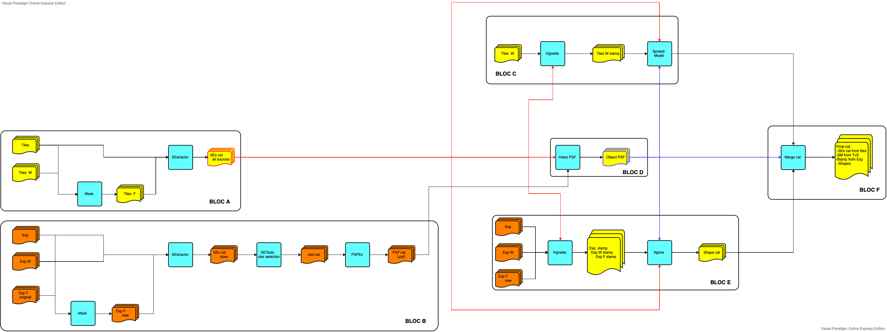

# ShapePipe usage tutorial

## Index

1. [Introduction](#Introduction)
    1. [Numbering](#Numbering)
    1. [CFIS porcessing](#CFIS-processing)
1. [ Field and image selection](#Selection)
1. [ Single exposures processing](#Single-exposures-processing)
    1. [Spliting](#Spliting)
    1. [Masking single exposures](#Masking-single-exposures)
    1. [Source identification single exposures](#Source-identificationg-single-exposures)
    1. [Star selection](#Star-selection)
    1. [PSF estimation](#PSF-estimation)
    1. [Validation tests](#Validation tests)
    1. [Full run config file](#Full-run-config-file)
1. [Stacks processing](#Stack-processing)
    1. [Masking stacked images](#Masking-stacked-images)
    1. [Source identification stacked images](#Source-identification-stacked-images)
    1. [PSF interpolation](#PSF-interpolation)
    1. [Prepare spread-model](#Prepare-spread-model)
    1. [Spread-Model](#Spread-Model)
    1. [Prepare shape measurement](#Prepare-shape-measurement)
    1. [NGMIX : Shape measurement](#NGMIX-:-Shape measurement)
    1. [Make final catalog](#Make-final-catalog)

## Introduction

The `ShapePipe` pipeline can process single-exposures images, and stacked images. The input images have to be calibrated beforehand for astrometry and photometry.

***WARNING /!\ :*** All the paths on the examples are relatives. When running on clusters make sure they make sense. Prefer absolute paths to avoid problems. Some of them are dummy examples.

### File types, naming and numbering convention

The `ShapePipe` pipeline handles different image and file types, some of which
are create by the pipeline during analysis. These types are listed below. Those
files follow a naming and numbering convention, to facilitate bookkeeping for
tracking relevant image information. We adopt a numbering schemes as follows.

- Single-exposure image.  
  Multi-HDU FITS file containing a mosaic from multiple CCDs of a single exposure (one CCD per HDU).
  These images are typically created by a telescope analysis software (e.g.~`pitcairn`), and used on input
  by `ShapePipe`. The pixel data can contain the observed image, a weight map, or a flag map.

- Single-exposure single-CCD image.  
  FITS file containing a single CCD from an individual exposure. The pixel data can contain the observed image, a weight map, or a flag map.  
  **<image_type>-<exposure_name>-<CCD_number>.fits**  
  Examples: `image-2079614-9.fits`, `weight-2079614-3.fits`

- Stacked images:  
  FITS file containing a stack of different single exposures, or tile, for example created by `swarp`.
  The pixel data can contain the observed image, a weight map, or a flag map.  
  **<image_type>-<number>.fits**  
  Examples: `CFIS_image-51.fits`, `pipeline_flag-2134.fits`

### CFIS processing

Processing of CFIS images can be separated into three categories: Field selection, analysis of single exposures,
analysis of stacks.

At the moment, single exposures first have to be split into single-CCDs images.
The single-exposure single-CCD images are then processed independently.

* Field and image selection.
* Processing of single exposures.
  * Split each CCDs
  * Create masks for bright stars, spikes, borders, Messier objects, ...
  * Detect stars
  * PSF modeling
  * Validation of the PSF model (optional)
* Stack images.
  * Create mask for bright stars, spikes, border, ...
  * Detect all sources
  * Interpolate the PSF model at the location of each sources for all epochs contributing
  * Create postage stamps necessary for the spread-model
  * Get the spread model for each source
  * Create postage stamps for the shape measurement
  * Shape measurement (NGMIX only at the moment)
  * Merge all results into on main catalog

Flowchart presenting the process:



## Field and image selection

The selection of images in input can be done in the config files of the relevant modules, by specifying input
path(s) and input file name patterns. Thus, a sub-selection of images in a given input directory can be done.
However, one might want to pre-select images before the pipeline is run. For example, to find all images (exposures
and stacks) in a given sky area. These can then be copied to a dedicated directory (or linked using symbolic links),
or downloaded to a local machine.

### Selection of exposures.

Option 1. Selection by area from log file.

## Single-exposures processing

### Spliting

**Module :** splip_exp_runner   
**Module inputs :** single_exp_image, single_exp_flag, single_exp_weight   
**Script :** create_log_exp_headers.py

Before the process start we have to split all the single exposures images to CCD images.

Here is a commented example for the pipeline config file :

```ini
[SPLIT_EXP_RUNNER]

# Need to be of the same size as FILE_PATTERN and follow
# the same order of files.
# Keyword "flag" will lead to a behavior where the data are save as int.
# The code also expect the image data to use the "image" suffix (to handle WCS)
# (default value in the pipeline).
OUTPUT_SUFFIX = image,weight,flag

# Number of CCDs in the mosaic
N_HDU = 40
```

During the process of this module we save the WCS information for each CCDs. Now we have to merge all of them into one file. This automatically done by the scipt `create_log_exp_headers.py`. To use it :

```bash
python create_log_exp_headers.py path/to/split_exp_runner/output path/to/srcipt/output_dir
```
Remember the output, it will be required for later processing. The output file is named : `log_exp_headers.npy`.


### Masking single exposures

**Module :** mask_runner   
**Module inputs :** splited_single_exp_image, splited_single_exp_weight, splited_single_exp_flag, (star_cat)   
**Script :** create_star_cat.py

Here we will create masks for bright stars, spikes and borders. We will also include the already existing masking for the cosmic rays and various artifacts.  
Since computing nodes on clusters don't usually have an internet access we will have to first create a star catalog for each images with the script : `create_star_cat.py`. To use it :

```bash
python create_star_cat.py path/to/image_dir path/to/script/output_dir
```

Once the star catalogs are created we can run the module.
Here is a commented example config file for the pipeline :
```ini
[MASK_RUNNER]

MASK_CONFIG_PATH = ./example/test_all_exp/config.mask

# If true will expect an external mask file
USE_EXT_FLAG = True

# If true will expect an external star catalog
USE_EXT_STAR = True

# Suffix for the output file. (OPTIONAL)
# ex : SUFFIX_flag_NUMBERING.fits or flag_NUMBERING.fits if not provided
SUFFIX = pipeline
```

Here is a commented example config file for the module :

```ini
[PROGRAM_PATH]

WW_PATH = ww
WW_CONFIG_FILE = ./example/test_mask/mask_default/default.ww

# If external star catalogs are provided comment the parameter bellow
#CDSCLIENT_PATH = findgsc2.2


[BORDER_PARAMETERS]

# NOTE : there is already a border on the individual exposure flag images of 50 pixels but you can enlarge it.
BORDER_MAKE = True

BORDER_WIDTH = 50
BORDER_FLAG_VALUE = 4


[HALO_PARAMETERS]

HALO_MAKE = True

HALO_MASKMODEL_PATH = ./example/test_mask/mask_default/halo_mask.reg
HALO_MAG_LIM = 13.
HALO_SCALE_FACTOR = 0.05
HALO_MAG_PIVOT = 13.8
HALO_FLAG_VALUE = 2
HALO_REG_FILE = halo.reg


[SPIKE_PARAMETERS]

SPIKE_MAKE = True

SPIKE_MASKMODEL_PATH = ./example/test_mask/mask_default/MEGAPRIME_star_i_13.8.reg
SPIKE_MAG_LIM = 18.
SPIKE_SCALE_FACTOR = 0.3
SPIKE_MAG_PIVOT = 13.8
SPIKE_FLAG_VALUE = 128
SPIKE_REG_FILE = spike.reg


[MESSIER_PARAMETERS]

MESSIER_MAKE = True

MESSIER_CAT_PATH = ./example/test_mask/mask_default/Messier_catalog_updated.npy
MESSIER_PIXEL_SCALE = 0.186
MESSIER_SIZE_PLUS = 0.
MESSIER_FLAG_VALUE = 16


[EXTERNAL_FLAG]

EF_MAKE = True


[MD_PARAMETERS]

MD_MAKE = False

MD_THRESH_FLAG = 0.3
MD_THRESH_REMOVE = 0.75
MD_REMOVE = False


[OTHER]

KEEP_REG_FILE = False
KEEP_INDIVIDUAL_MASK = False

# WARNING : at the end the directory is cleared entirely make sure there is no other important files in it.
TEMP_DIRECTORY = ./.temp2
```

### Source identification single exposures

**Module :** sextractor_runner   
**Module inputs :** single_exp_image, single_exp_weight, single_exp_flag

On the single exposures we focus the source identification on stars. Thats means we will use a higher detection threshold in order to avoid some artifacts and reduce the size of the catalog.
Here is a commented example config file for the pipeline :

```ini
[SEXTRACTOR_RUNNER]

EXEC_PATH = sex

DOT_SEX_FILE = ./example/test_all_exp/default.sex
DOT_PARAM_FILE = ./example/test_sex/default.param

WEIGHT_IMAGE = True
FLAG_IMAGE = True
PSF_FILE = False

#CHECKIMAGE can be a list of BACKGROUND, BACKGROUND_RMS,
#INIBACKGROUND, MINIBACK_RMS, -BACKGROUND,
#FILTERED, OBJECTS, -OBJECTS, SEGMENTATION, APERTURES
# NOTE : here we request the background because we will need it later for the shape measurement.
CHECKIMAGE = BACKGROUND

# Suffix for the output file. (OPTIONAL)
# ex : SUFFIX_sexcat_NUMBERING.fits or sexcat_NUMBERING.fits if not provided
# NOTE : this avoid confusion with the catalog produce for the stacked images.
SUFFIX = exp

# Only done on the tiles
MAKE_POST_PROCESS = False
```

Here is a commented example config file for the module :

```text
#-------------------------------- Catalog ------------------------------------

CATALOG_TYPE     FITS_LDAC

PARAMETERS_NAME  ./example/test_sex/default.param

#------------------------------- Extraction ----------------------------------

DETECT_TYPE      CCD            # CCD (linear) or PHOTO (with gamma correction)
DETECT_MINAREA   10              # min. # of pixels above threshold
DETECT_MAXAREA   0              # max. # of pixels above threshold (0=unlimited)
THRESH_TYPE      RELATIVE       # threshold type: RELATIVE (in sigmas)
                                # or ABSOLUTE (in ADUs)
# NOTE : could work with an higher value.
DETECT_THRESH    2.             # <sigmas> or <threshold>,<ZP> in mag.arcsec-2
ANALYSIS_THRESH  1.5             # <sigmas> or <threshold>,<ZP> in mag.arcsec-2

FILTER           Y              # apply filter for detection (Y or N)?
FILTER_NAME      ./example/test_sex/default.conv
FILTER_THRESH                   # Threshold[s] for retina filtering

# NOTE : we really want to avoid blended objects for the PSF estimation. We could push that even more to be very conservative
DEBLEND_NTHRESH  32             # Number of deblending sub-thresholds
DEBLEND_MINCONT  0.001          # Minimum contrast parameter for deblending

CLEAN            Y              # Clean spurious detections? (Y or N)?
CLEAN_PARAM      1.0            # Cleaning efficiency

MASK_TYPE        CORRECT        # type of detection MASKing: can be one of
                                # NONE, BLANK or CORRECT

#-------------------------------- WEIGHTing ----------------------------------

WEIGHT_TYPE      MAP_WEIGHT     # type of WEIGHTing: NONE, BACKGROUND,
                                # MAP_RMS, MAP_VAR or MAP_WEIGHT
RESCALE_WEIGHTS  Y              # Rescale input weights/variances (Y/N)?
WEIGHT_IMAGE     weight.fits    # weight-map filename
WEIGHT_GAIN      Y              # modulate gain (E/ADU) with weights? (Y/N)
WEIGHT_THRESH                   # weight threshold[s] for bad pixels

#-------------------------------- FLAGging -----------------------------------

FLAG_IMAGE       flag.fits      # filename for an input FLAG-image
FLAG_TYPE        OR             # flag pixel combination: OR, AND, MIN, MAX
                                # or MOST

#------------------------------ Photometry -----------------------------------

PHOT_APERTURES   5              # MAG_APER aperture diameter(s) in pixels
PHOT_AUTOPARAMS  2.5, 3.5       # MAG_AUTO parameters: <Kron_fact>,<min_radius>
PHOT_PETROPARAMS 2.0, 3.5       # MAG_PETRO parameters: <Petrosian_fact>,
                                # <min_radius>
PHOT_AUTOAPERS   0.0,0.0        # <estimation>,<measurement> minimum apertures
                                # for MAG_AUTO and MAG_PETRO
PHOT_FLUXFRAC    0.5            # flux fraction[s] used for FLUX_RADIUS

SATUR_KEY        SATURATE       # keyword for saturation level (in ADUs)

# NOTE : 30 is probably not the good value but the photometry is done on the stack. We just need an approximation here.
MAG_ZEROPOINT    30.0           # magnitude zero-point
MAG_GAMMA        4.0            # gamma of emulsion (for photographic scans)

GAIN_KEY         GAIN           # keyword for detector gain in e-/ADU
PIXEL_SCALE      0.            # size of pixel in arcsec (0=use FITS WCS info)

#------------------------- Star/Galaxy Separation ----------------------------

# NOTE : Only necessary if CLASS_STAR parameter is required. (0.6 optimist value, 0.7 more realistic)
SEEING_FWHM      0.6            # stellar FWHM in arcsec
STARNNW_NAME     ./example/test_sex/default.nnw

#------------------------------ Background -----------------------------------

# NOTE : Important for the single exposures since the background is not substarcted
BACK_TYPE        AUTO           # AUTO or MANUAL
BACK_VALUE       0.0            # Default background value in MANUAL mode
BACK_SIZE        64 # or 16       Background mesh: <size> or <width>,<height>
BACK_FILTERSIZE  3  # or 5        Background filter: <size> or <width>,<height>

BACKPHOTO_TYPE   GLOBAL         # can be GLOBAL or LOCAL
BACKPHOTO_THICK  24             # thickness of the background LOCAL annulus
BACK_FILTTHRESH  0.0            # Threshold above which the background-map filter operates
```

### Star selection

**Module :** setools_runner   
**Module inputs :** sextractor_catalog

For the star selection we use a simple size/magnitude plan. We first find the stellar locus (using the mode of the FWHM) and select object around this value in a range of magnitude. Here is a commented example config file for the pipeline :

```ini
[SETOOLS_RUNNER]

SETOOLS_CONFIG_PATH = /home/guinot/pipeline/ShapePipe/example/test_all_exp/star_selection.setools
```

Here is a commented example config file for the module :
```text
[MASK:preselect]
# NOTE : This mask is only use to preselect the region where the we expect to have the stellar locus. This avoid weird behavior
MAG_AUTO > 0
MAG_AUTO < 20
FWHM_IMAGE > 0.3 / 0.186
FWHM_IMAGE < 1.5 / 0.186
FLAGS == 0
IMAFLAGS_ISO == 0
NO_SAVE

[MASK:star_selection]
MAG_AUTO > 17.
MAG_AUTO < 21.5
# NOTE : unit is pixel
FWHM_IMAGE <= mode(FWHM_IMAGE{preselect}) + 0.2
FWHM_IMAGE >= mode(FWHM_IMAGE{preselect}) - 0.2
FLAGS == 0
IMAFLAGS_ISO == 0
#CLASS_STAR != 0

[MASK:fwhm_mag_cut]
# NOTE : Only use for plotting
FWHM_IMAGE > 0
FWHM_IMAGE < 40
MAG_AUTO < 35
FLAGS == 0
IMAFLAGS_ISO == 0
NO_SAVE

###

[PLOT:size_mag]
TYPE = plot
FORMAT = png
X_1 = FWHM_IMAGE{fwhm_mag_cut}
Y_1 = MAG_AUTO{fwhm_mag_cut}
X_2 = FWHM_IMAGE{star_selection}
Y_2 = MAG_AUTO{star_selection}
MARKER_1 = +
MARKER_2 = .
MARKERSIZE_1 = 3
MARKERSIZE_2 = 3
LABEL_1 = All
LABEL_2 = "Star selection, mean : @mean(FWHM_IMAGE{star_selection})@"
TITLE = "Star selection"
XLABEL = "FWHM (pix)"
YLABEL = Mag

[PLOT:hist_mag_stars]
TYPE = hist
FORMAT = png
Y = MAG_AUTO{star_selection}
BIN = 20
LABEL = "Mag of stars selected"
XLABEL = "Mag"
YLABEL = "Nb"
TITLE = "Mag of stars selected"

[PLOT:fwhm_field]
TYPE = scatter
FORMAT = png
X = X_IMAGE{star_selection}
Y = Y_IMAGE{star_selection}
SCATTER = FWHM_IMAGE{star_selection}*0.186
MARKER = .
LABEL = "FWHM (arcsec)"
TITLE = "Stars FWHM in field"
XLABEL = "X (pix)"
YLABEL = "Y (pix)"

[PLOT:mag_star_field]
TYPE = scatter
FORMAT = png
X = X_IMAGE{star_selection}
Y = Y_IMAGE{star_selection}
SCATTER = MAG_AUTO{star_selection}
MARKER = .
LABEL = "Mag (arcsec)"
TITLE = "Stars Mag in field"
XLABEL = "X (pix)"
YLABEL = "Y (pix)"

[STAT:star_stat]
"Nb objects full cat" = len(FWHM_IMAGE)
"Nb stars" = len(FWHM_IMAGE{star_selection})
"stars/deg^2" = len(FWHM_IMAGE{star_selection})/4612./0.186*3600.*1./2048./0.186*3600.
"Mean star fwhm selected (arcsec)" = mean(FWHM_IMAGE{star_selection})*0.186
"Standard deviation fwhm star selected (arcsec)" = std(FWHM_IMAGE{star_selection})*0.186
"Mode fwhm used (arcsec)" = mode(FWHM_IMAGE{preselect})*0.186
"Min fwhm cut (arcesec)" = mode(FWHM_IMAGE{preselect})*0.186-0.1*0.186
"Max fwhm cut (arcsec)" = mode(FWHM_IMAGE{preselect})*0.186+0.1*0.186
```  

### PSF estimation

**Module :** psfex_runner   
**Module inputs :** setools_star_selection

The PSF estimation is done with PSFEx. Here is a commented example config file for the pipeline :

```ini
[PSFEX_RUNNER]
EXEC_PATH = psfex

DOT_PSFEX_FILE = ./example/test_psfex/default.psfex
```

Here is a commented example config file for the module :

```text
#-------------------------------- PSF model ----------------------------------

BASIS_TYPE      PIXEL      # NONE, PIXEL, GAUSS-LAGUERRE or FILE
BASIS_NUMBER    20              # Basis number or parameter
BASIS_NAME      basis.fits      # Basis filename (FITS data-cube)
BASIS_SCALE     1.0             # Gauss-Laguerre beta parameter
NEWBASIS_TYPE   NONE            # Create new basis: NONE, PCA_INDEPENDENT
                                # or PCA_COMMON
NEWBASIS_NUMBER 8               # Number of new basis vectors
PSF_SAMPLING    1.              # Sampling step in pixel units (0.0 = auto)
PSF_PIXELSIZE   1.0             # Effective pixel size in pixel step units
PSF_ACCURACY    0.01            # Accuracy to expect from PSF "pixel" values
PSF_SIZE        51,51           # Image size of the PSF model
PSF_RECENTER    N               # Allow recentering of PSF-candidates Y/N ?
MEF_TYPE        INDEPENDENT     # INDEPENDENT or COMMON

#------------------------- Point source measurements -------------------------

CENTER_KEYS     XWIN_IMAGE,YWIN_IMAGE # Catalogue parameters for source pre-centering
PHOTFLUX_KEY    FLUX_AUTO    # Catalogue parameter for photometric norm.
PHOTFLUXERR_KEY FLUXERR_AUTO # Catalogue parameter for photometric error

#----------------------------- PSF variability -------------------------------

PSFVAR_KEYS     XWIN_IMAGE,YWIN_IMAGE # Catalogue or FITS (preceded by :) params
PSFVAR_GROUPS   1,1             # Group tag for each context key
PSFVAR_DEGREES  2               # Polynom degree for each group
PSFVAR_NSNAP    9               # Number of PSF snapshots per axis
HIDDENMEF_TYPE  COMMON          # INDEPENDENT or COMMON
STABILITY_TYPE  EXPOSURE        # EXPOSURE or SEQUENCE

#----------------------------- Sample selection ------------------------------

# NOTE : since the stars are selected independently we don't use this part
SAMPLE_AUTOSELECT  N            # Automatically select the FWHM (Y/N) ?

BADPIXEL_FILTER    N            # Filter bad-pixels in samples (Y/N) ?
BADPIXEL_NMAX      0            # Maximum number of bad pixels allowed

#----------------------- PSF homogeneisation kernel --------------------------

HOMOBASIS_TYPE     NONE         # NONE or GAUSS-LAGUERRE
HOMOBASIS_NUMBER   10           # Kernel basis number or parameter
HOMOBASIS_SCALE    1.0          # GAUSS-LAGUERRE beta parameter
HOMOPSF_PARAMS     2.0, 3.0     # Moffat parameters of the idealised PSF
HOMOKERNEL_DIR                  # Where to write kernels (empty=same as input)
HOMOKERNEL_SUFFIX  .homo.fits   # Filename extension for homogenisation kernels

#----------------------------- Output catalogs -------------------------------

# NOTE : This catalog is required for the interpolation
OUTCAT_TYPE        FITS_LDAC         # NONE, ASCII_HEAD, ASCII, FITS_LDAC
```

### Validation tests

**Module :** psfinterp_runner   
**Module :** setools_star_selection, psfex_catalog

The interpolation of the PSF is not done at this stage for the shape measurement. But, in order to make validation tests on the model we need the model at the position of the stars used. For that we run the module : `psfinterp_runner` on `VALIDATION` mode. Here is a commented example config file for the pipeline :

```ini
# Define the way psfexinter will run.
# CLASSIC for classical run.
# MULTI-EPOCH for multi epoch.
# VALIDATION for output allowing validation (only on single epoch !)
MODE = VALIDATION

GET_SHAPES = True

# Number minimal of stars require to interpolate the PSF on the CCD
STAR_THRESH = 20
# Maximum value allowed for the global chi2 of the model for the CCD
CHI2_THRESH = 2

# When running in multi-epoch those position has to be WCS !
POSITION_PARAMS = XWIN_IMAGE,YWIN_IMAGE
```

### Full run config file

Except for the spliting step, all the process can be done automatically. Here is an example config for the pipeline :

```ini
# ShapePipe Configuration File Example

## Default ShapePipe options
[DEFAULT]
# VERBOSE (optional) default is True, i.e. print everything
; VERBOSE = False
# RUN_NAME (optional) default is shapepipe_run
; RUN_NAME = my_shapepipe_run
# RUN_DATETIME (optional) default is True, i.e. add DATE and TIME to RUN_NAME
; RUN_DATETIME = False

## ShapePipe execution options
[EXECUTION]
# MODULE (required) must be a valid module runner name (or a comma separated list of names)
MODULE = mask_runner, sextractor_runner, setools_runner, psfex_runner, psfexinterp_runner
MODE = SMP

## ShapePipe file handling options
[FILE]
# LOG_NAME (optional) default is shapepipe
; LOG_NAME = my_shapepipe_log
# RUN_LOG_NAME (optional) default is shapepipe_runs
; RUN_LOG_NAME = my_shapepipe_run_log
# INPUT_DIR (required) must be a valid directory containing input files for the first module
INPUT_DIR = last:split_exp_runner,/path/to/external/star/catalos/directory
# OUTPUT_DIR (required) must be a valid directory to write the pipeline output files
# NOTE : In order to use the 'last' keyword point to the same directory as the one use for the spliting step
OUTPUT_DIR = /same/as/spliting/runner
# FILE_PATTERN (opional) list of string patterns to identify input files
FILE_PATTERN = image,weight,flag,star_cat
# FILE_EXT (opional) list of string extensions to identify input files
FILE_EXT = .fits,.fits,.fits,.cat
# NUMBERING_SCHEME (optional) string with numbering pattern for input files
NUMBERING_SCHEME = -0000000-0

## ShapePipe job handling options
[JOB]
# BATCH_SIZE (optional) default is 1, i.e. run all jobs in serial
SMP_BATCH_SIZE = 48
# TIMEOUT (optional) default is None, i.e. no timeout limit applied
# NOTE : the longest step is the PSF estimation (around 5 minutes)
TIMEOUT = 10:00:00

## Module options
[MASK_RUNNER]

MASK_CONFIG_PATH = ./example/test_all_exp/config.mask

USE_EXT_FLAG = True
USE_EXT_STAR = True

# Suffix for the output file. (OPTIONAL)
# ex : SUFFIX_flag_NUMBERING.fits or flag_NUMBERING.fits if not provided
SUFFIX = pipeline

[SEXTRACTOR_RUNNER]

ADD_INPUT_DIR = /path/to/spliting/run/shapepipe_date_hour/split_exp_runner/output
FILE_PATTERN = image,weight,pipeline_flag

EXEC_PATH = sex

DOT_SEX_FILE = ./example/test_all_exp/default.sex
DOT_PARAM_FILE = ./example/test_sex/default.param

WEIGHT_IMAGE = True
FLAG_IMAGE = True
PSF_FILE = False

#CHECKIMAGE can be a list of BACKGROUND, BACKGROUND_RMS,
#INIBACKGROUND, MINIBACK_RMS, -BACKGROUND,
#FILTERED, OBJECTS, -OBJECTS, SEGMENTATION, APERTURES
CHECKIMAGE = BACKGROUND

# Suffix for the output file. (OPTIONAL)
# ex : SUFFIX_sexcat_NUMBERING.fits or sexcat_NUMBERING.fits if not provided
SUFFIX = exp

MAKE_POST_PROCESS = False

[SETOOLS_RUNNER]

SETOOLS_CONFIG_PATH = ./example/test_all_exp/star_selection.setools

[PSFEX_RUNNER]

EXEC_PATH = psfex

DOT_PSFEX_FILE = ./example/test_psfex/default.psfex

#CHECKIMAGE can be a list of CHI,PROTOTYPES,SAMPLES,
#RESIDUALS,SNAPSHOTS, MOFFAT,-MOFFAT,-SYMMETRICAL or NONE
; CHECKIMAGE = RESIDUALS

[PSFEXINTERP_RUNNER]

FILE_PATTERN = star_selection,star_selection,psfex_cat
FILE_EXT = .psf,.fits,.cat

# Define the way psfexinter will run.
# CLASSIC for classical run.
# MULTI-EPOCH for multi epoch.
# VALIDATION for output allowing validation (only on single epoch !)
MODE = VALIDATION

GET_SHAPES = True

STAR_THRESH = 20
CHI2_THRESH = 2

# When running in multi-epoch those position has to be WCS !
POSITION_PARAMS = XWIN_IMAGE,YWIN_IMAGE
```

## Stacks processing

### Masking stacked images

**Module :** mask_runner   
**Module inputs :** tile_image, tile_weight, (star_cat)   
**Script :** create_star_cat.py

Here we will create masks for bright stars, spikes and borders. Since computing nodes on clusters don't usually have an internet access we will have to first create a star catalog for each images with the script : `create_star_cat.py`. To use it :

```bash
python create_star_cat.py path/to/image_dir path/to/script/output_dir
```

Once the star catalogs are created we can run the module.
Here is a commented example config file for the pipeline :
```ini
[MASK_RUNNER]

MASK_CONFIG_PATH = ./example/test_all_tile/config.mask

# If true will expect an external mask file
USE_EXT_FLAG = True

# If true will expect an external star catalog
USE_EXT_STAR = True

# Suffix for the output file. (OPTIONAL)
# ex : SUFFIX_flag_NUMBERING.fits or flag_NUMBERING.fits if not provided
SUFFIX = pipeline
```

Here is a commented example config file for the module :

```ini
[PROGRAM_PATH]

WW_PATH = ww
WW_CONFIG_FILE = ./example/test_mask/mask_default/default.ww

# If external star catalogs are provided comment the parameter bellow
#CDSCLIENT_PATH = findgsc2.2


[BORDER_PARAMETERS]

# NOTE : On the tiles it is not necessary to mask the borders
BORDER_MAKE = False

BORDER_WIDTH = 50
BORDER_FLAG_VALUE = 4


[HALO_PARAMETERS]

HALO_MAKE = True

HALO_MASKMODEL_PATH = ./example/test_mask/mask_default/halo_mask.reg
HALO_MAG_LIM = 13.
HALO_SCALE_FACTOR = 0.05
HALO_MAG_PIVOT = 13.8
HALO_FLAG_VALUE = 2
HALO_REG_FILE = halo.reg


[SPIKE_PARAMETERS]

SPIKE_MAKE = True

SPIKE_MASKMODEL_PATH = ./example/test_mask/mask_default/MEGAPRIME_star_i_13.8.reg
SPIKE_MAG_LIM = 18.
SPIKE_SCALE_FACTOR = 0.3
SPIKE_MAG_PIVOT = 13.8
SPIKE_FLAG_VALUE = 128
SPIKE_REG_FILE = spike.reg


[MESSIER_PARAMETERS]

MESSIER_MAKE = True

MESSIER_CAT_PATH = ./example/test_mask/mask_default/Messier_catalog_updated.npy
MESSIER_PIXEL_SCALE = 0.186
MESSIER_SIZE_PLUS = 0.
MESSIER_FLAG_VALUE = 16


[EXTERNAL_FLAG]

# We don't have any mask for the stacked images. Most artifacts are time dependent and remove during stacking (not entirely true..)
EF_MAKE = False


[MD_PARAMETERS]

MD_MAKE = False

MD_THRESH_FLAG = 0.3
MD_THRESH_REMOVE = 0.75
MD_REMOVE = False


[OTHER]

KEEP_REG_FILE = False
KEEP_INDIVIDUAL_MASK = False

# WARNING : at the end the directory is cleared entirely make sure there is no other important files in it.
TEMP_DIRECTORY = ./.temp2
```

### Source identification stacked images

**Module :** sextractor_runner   
**Module inputs :** tile_image, tile_weight, tile_flag

On the tiles we want to detect all the sources. For that we set a low detection threshold.  
Also, we run a post-processing step on each tiles to find all epochs contributing to each objects. Here is a commented example config file for the pipeline :

```ini
[SEXTRACTOR_RUNNER]

EXEC_PATH = sex

DOT_SEX_FILE = ./example/test_all_tile/default.sex
DOT_PARAM_FILE = ./example/test_sex/default.param

WEIGHT_IMAGE = True
FLAG_IMAGE = True
PSF_FILE = False

#CHECKIMAGE can be a list of BACKGROUND, BACKGROUND_RMS,
#INIBACKGROUND, MINIBACK_RMS, -BACKGROUND,
#FILTERED, OBJECTS, -OBJECTS, SEGMENTATION, APERTURES
; CHECKIMAGE = BACKGROUND

# Suffix for the output file. (OPTIONAL)
# ex : SUFFIX_sexcat_NUMBERING.fits or sexcat_NUMBERING.fits if not provided
SUFFIX = tile

#####################
# POST-PROCESS PART #
#####################
# This part only concern tiles. It will make the management of multi-epoch possible.

MAKE_POST_PROCESS = True

# Create with the split_exp_hdu module
LOG_WCS = /path/to/file/containing/WCS/information/log_exp_headers.npy

# World coordinate to use (those parameters has to be required as output of SExtractor)
WORLD_POSITION = XWIN_WORLD,YWIN_WORLD

# Size of one CCD in pixel
# x_min,x_max,y_min,y_max
# NOTE : For CFIS images the header keyword is 'DATASEC'
CCD_SIZE = 33,2080,1,4612
```

Here is a commented example config file for the module :

```text
#-------------------------------- Catalog ------------------------------------

CATALOG_TYPE     FITS_LDAC

PARAMETERS_NAME  /home/guinot/pipeline/ShapePipe/example/test_sex/default.param

#------------------------------- Extraction ----------------------------------

DETECT_TYPE      CCD            # CCD (linear) or PHOTO (with gamma correction)
DETECT_MINAREA   10              # min. # of pixels above threshold
DETECT_MAXAREA   0              # max. # of pixels above threshold (0=unlimited)
THRESH_TYPE      RELATIVE       # threshold type: RELATIVE (in sigmas)
                                # or ABSOLUTE (in ADUs)
# NOTE : On noisy images a lower value will mostly add false detections
DETECT_THRESH    1.5             # <sigmas> or <threshold>,<ZP> in mag.arcsec-2
ANALYSIS_THRESH  1.5             # <sigmas> or <threshold>,<ZP> in mag.arcsec-2

FILTER           Y              # apply filter for detection (Y or N)?
FILTER_NAME      ./example/test_sex/default.conv
FILTER_THRESH                   # Threshold[s] for retina filtering

# NOTE : Not really use at the moment. Objects flaggeg are removes
DEBLEND_NTHRESH  32             # Number of deblending sub-thresholds
DEBLEND_MINCONT  0.0005         # Minimum contrast parameter for deblending

CLEAN            Y              # Clean spurious detections? (Y or N)?
CLEAN_PARAM      1.0            # Cleaning efficiency

MASK_TYPE        CORRECT        # type of detection MASKing: can be one of
                                # NONE, BLANK or CORRECT

#-------------------------------- WEIGHTing ----------------------------------

WEIGHT_TYPE      MAP_WEIGHT     # type of WEIGHTing: NONE, BACKGROUND,
                                # MAP_RMS, MAP_VAR or MAP_WEIGHT
RESCALE_WEIGHTS  Y              # Rescale input weights/variances (Y/N)?
WEIGHT_IMAGE     weight.fits    # weight-map filename
WEIGHT_GAIN      Y              # modulate gain (E/ADU) with weights? (Y/N)
WEIGHT_THRESH                   # weight threshold[s] for bad pixels

#-------------------------------- FLAGging -----------------------------------

FLAG_IMAGE       flag.fits      # filename for an input FLAG-image
FLAG_TYPE        OR             # flag pixel combination: OR, AND, MIN, MAX
                                # or MOST

#------------------------------ Photometry -----------------------------------

PHOT_APERTURES   5              # MAG_APER aperture diameter(s) in pixels
PHOT_AUTOPARAMS  2.5, 3.5       # MAG_AUTO parameters: <Kron_fact>,<min_radius>
PHOT_PETROPARAMS 2.0, 3.5       # MAG_PETRO parameters: <Petrosian_fact>,
                                # <min_radius>
PHOT_AUTOAPERS   0.0,0.0        # <estimation>,<measurement> minimum apertures
                                # for MAG_AUTO and MAG_PETRO
PHOT_FLUXFRAC    0.5            # flux fraction[s] used for FLUX_RADIUS

SATUR_KEY        SATURATE       # keyword for saturation level (in ADUs)

# NOTE : Value set by the photometry
# NOTE : For CFIS images it is set to 30
MAG_ZEROPOINT    30.0            # magnitude zero-point
MAG_GAMMA        4.0            # gamma of emulsion (for photographic scans)

GAIN_KEY         GAIN           # keyword for detector gain in e-/ADU
PIXEL_SCALE      0.            # size of pixel in arcsec (0=use FITS WCS info)

#------------------------- Star/Galaxy Separation ----------------------------

SEEING_FWHM      0.6            # stellar FWHM in arcsec
STARNNW_NAME     /home/guinot/pipeline/ShapePipe/example/test_sex/default.nnw

#------------------------------ Background -----------------------------------

BACK_TYPE        MANUAL         # AUTO or MANUAL
BACK_VALUE       0.0            # Default background value in MANUAL mode
BACK_SIZE        64             # Background mesh: <size> or <width>,<height>
BACK_FILTERSIZE  3              # Background filter: <size> or <width>,<height>

BACKPHOTO_TYPE   GLOBAL         # can be GLOBAL or LOCAL
BACKPHOTO_THICK  24             # thickness of the background LOCAL annulus
BACK_FILTTHRESH  0.0            # Threshold above which the background-
                                # map filter operates
```

After the post-processing step the fits format is the following :
```python
Filename: tile_sexcat-0.fits
No.    Name      Ver    Type      Cards   Dimensions   Format
  0  PRIMARY       1 PrimaryHDU       4   ()      
  1  LDAC_IMHEAD    1 BinTableHDU     12   1R x 1C   [8560A]   
  2  LDAC_OBJECTS    1 BinTableHDU    180   25133R x 45C   [1J, 1I, 1E, 1E, ...]   
  3  EPOCH_0       1 BinTableHDU     16   25133R x 3C   [1J, 7A, 1J]   
  4  EPOCH_1       1 BinTableHDU     16   25133R x 3C   [1J, 7A, 1J]   
  5  EPOCH_2       1 BinTableHDU     16   25133R x 3C   [1J, 7A, 1J]   
  6  EPOCH_3       1 BinTableHDU     16   25133R x 3C   [1J, 7A, 1J]   
  7  EPOCH_4       1 BinTableHDU     16   25133R x 3C   [1J, 7A, 1J]   
  8  EPOCH_5       1 BinTableHDU     16   25133R x 3C   [1J, 7A, 1J]   
  9  EPOCH_6       1 BinTableHDU     16   25133R x 3C   [1J, 7A, 1J]   
 10  EPOCH_7       1 BinTableHDU     16   25133R x 3C   [1J, 7A, 1J]   
 11  EPOCH_8       1 BinTableHDU     16   25133R x 3C   [1J, 7A, 1J]
```

The first 3 HDUs correspond to the usual SExtractor output. Then, the HDUs `EPOCH_X` correspond to one single exposures (on the example 9 single exposures contribute to the stack). On those HDUs the columns are :
* **NUMBER** : object id atributed by SExtractor
* **EXP_NAME** : name of the single exposure (same for all objects of one HDU)
* **CCD_N** : CCD number in which the object is following the MegaCam numbering (set to -1 if the object is not on the single exposure)

Those additionnal HDUs contain all the multi-epoch informations we need for the rest of the processing.

### PSF interpolation

**Module :** psfexinterp_runner   
**Module inputs :** sextractor_catalog

Now we need to interpolate the PSF at the position of all detected sources for all epochs where the object appears. Here is a commented example config file for the pipeline :

```ini
[PSFEXINTERP_RUNNER]

# Define the way psfexinter will run.
# CLASSIC for classical run.
# MULTI-EPOCH for multi epoch.
# VALIDATION for output allowing validation (only on single epoch !)
MODE = MULTI-EPOCH

STAR_THRESH = 20
CHI2_THRESH = 2
# When running in multi-epoch those position has to be WCS !
POSITION_PARAMS = XWIN_WORLD,YWIN_WORLD
GET_SHAPES = True

# Directory where all the .psf files are for the CCD images (output of the PSFEx run)
ME_DOT_PSF_DIR = /single/epoch/run/shapepipe_run_date_hour/psfex_runner/output/
# Common part of the .psf files.
# Example : for "star_single-0123456-34.psf" set "star_single"
ME_DOT_PSF_PATTERN = star_selection_psfex
# Create with the split_exp_hdu module
ME_LOG_WCS = /path/to/file/containing/WCS/information/log_exp_headers.npy
```

The output format is `sqlite`. The structure is similar to a dictionary with the following format :
```python
{'object_id': {'exp_name-CCD_number' : {'VIGNET': numpy.ndarray, 'SHAPES': {}}}
```

Example :

```python
{'1': {'2104127-35': {'VIGNET': numpy.ndarray, 'SHAPES': {}},
       '2105224-13': {'VIGNET': numpy.ndarray, 'SHAPES': {}},
       '2105382-3':  {'VIGNET': numpy.ndarray, 'SHAPES': {}}},
 '2': {'2104127-33': {'VIGNET': numpy.ndarray, 'SHAPES': {}},
       '2105224-12': {'VIGNET': numpy.ndarray, 'SHAPES': {}},
       '2105382-2':  {'VIGNET': numpy.ndarray, 'SHAPES': {}}},
 ...}
```


### Prepare spread-model

**Module :** vignetmaker_runner   
**Module inputs :** sextractor_catalog, tile_weight

To select the galaxy sample we will use the spread-model. To compute it we need :
* The vignet of the object on the stack
* The PSF information at the object location
* The vignet of the weight image at the object location

We already have the first two. In order to get the weight information we use the module : `vignetmaker_runner` to get postage stamps at the location of all objects detected by SExtractor. The weight we use here is the stacked weight since the detection is done on the stacks. Here is a commented example config file for the pipeline :

```ini
[VIGNETMAKER_RUNNER]

MASKING = False
MASK_VALUE = 0

MODE = CLASSIC

# Set type of coordinates to use in : PIX (pixel), SPHE (spherical).
COORD = PIX
POSITION_PARAMS = XWIN_IMAGE,YWIN_IMAGE
STAMP_SIZE = 51
# The name will be : SUFFIX_vignet.fits
SUFFIX = weight
```

### Spread-Model

**Module :** spread_model_runner
**Module inputs :** sextractor_catalog, tile_psf, tile_weight_vignet

As mentioned above, to classify objects we use the spread-model. Now we have all the informations we need to compute it. Here is a commented example config file for the pipeline :

```ini
[SPREAD_MODEL_RUNNER]

# Suffix for the output file. (OPTIONAL)
# ex : SUFFIX_sexcat_sm_NUMBERING.fits or sexcat_sm_NUMBERING.fits if not provided
;SUFFIX =
PIXEL_SCALE = 0.186

; Must be in [new, add].
; 'new' will create a new catalog with : [number, mag, sm, sm_err]
; 'add' will output a copy of the input SExtractor with the column sm and sm_err.
OUTPUT_MODE = new
```

### Prepare shape measurement

**Module :** vignetmaker_runner2   
**Module inputs :** sextractor_catalog

As for the previous step, the shape measurement need some preparation. Here is all the files required :
* The SExtractor catalogs from the tiles
* The vignets of all objects for all single epochs
* The vignets of the weights for all single epochs
* The vignets of the flags for all single epochs
* The vignets of the backgrounds for all single epochs
* The vignets of the PSFs for all single epochs


 We will use the `vignetmaker_runner2` to get all the informations we need with the `MULTI-EPOCH` mode.
This time the postage stamps are done from the single epoch files. Here is a commented example config file for the pipeline :

```ini
[VIGNETMAKER_RUNNER2]

MASKING = False
MASK_VALUE = 0

MODE = MULTI-EPOCH

# Set type of coordinates to use in : PIX (pixel), SPHE (spherical).
COORD = SPHE
POSITION_PARAMS = XWIN_WORLD,YWIN_WORLD
STAMP_SIZE = 51
# The name will be : SUFFIX_vignet.fits
SUFFIX =

# List of the directories where the images are
# NOTE : one directory per image type
ME_IMAGE_DIR = /directory/of/flags/split_exp_runner/output,
               /directory/of/images/split_exp_runner/output,
               /directory/of/weights/split_exp_runner/output,
               /directory/of/backgrounds/sextractor_runner/output
# Common part of the different file types.
# Example : for "image-0123456-34.fits" set "image"           
ME_IMAGE_PATTERN = flag,image,weight,exp_background

# Create with the split_exp_hdu module
ME_LOG_WCS = /path/to/file/containing/WCS/information/log_exp_headers.npy
```

For those files the data structure is the same as the one use for the module `psfexinterp_runner` in multi-epoch mode.

### NGMIX : Shape measurement

**Module :** ngmix_runner   
**Module inputs :** sextractor_catalog, single_exp_image_vignet, single_exp_bkg_vignet, tile_psf, single_exp_weight_vignet, single_exp_flag_vignet

Now we run the shape measurement. At the moment it's done with NGMIX. Most of the features are hard coded (will be more flexible in the future). Here is a commented example config file for the pipeline :

```ini
[NGMIX_RUNNER]

# Create with the split_exp_hdu module
LOG_WCS = /path/to/file/containing/WCS/information/log_exp_headers.npy
```

### Make final catalog

**Module :** make_catalog_runner   
**Module inputs :** sextractor_catalog, spread_model, tile_psf, ngmix_catalog

We finally merge all the results into one catalog per tiles. Here is a commented example config file for the pipeline :

```ini
[MAKE_CATALOG_RUNNER]

# If true will add a column in the final catalog : "SPREAD_CLASS"
SM_DO_CLASSIFICATION = True
# The classification is done by computing :
# classif = SPREAD_MODEL + 5/3 * SPREADERR_MODEL
# The cut for the star : |classif| < SM_STAR_STRESH
SM_STAR_STRESH = 0.003
# The cut for the galaxies : classif > SM_GAL_THRESH
SM_GAL_THRESH = 0.01
```

**Tips :** At the end we have one catalog per tiles. Here are a piece of code to merge all of them (assuming you are in the directory with all the catalogs) :

```python
import os
import numpy as np
from shapepipe.pipeline import file_io as io

all_file = os.listdir()

cat = io.FITSCatalog(all_file[0])
cat.open()

data = np.copy(cat.get_data())

cat.close

for f in all_file[1:]:
  cat = io.FITSCatalog(f)
  cat.open()

  data = np.concatenate((data, np.copy(cat.get_data())))

  cat.close()

final_catalog = io.FITSCatalog('final_cat.fits', open_mode=io.BaseCatalog.OpenMode.ReadWrite)

final_catalog.save_as_fits(data, ext_name='RESULTS')

```
