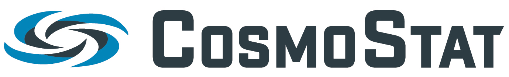

ShapePipe
=========

.. Include table of contents
.. include:: toc.rst

ShapePipe is a galaxy shape measurement pipeline developed within the
|link-to-cosmostat| lab at CEA Paris-Saclay.

This documentation aims to provide all the information needed for installing
and running ShapePipe. If you unable to find what you are looking for here,
we invite you to |link-to-issues| on the GitHub repository an we will do our
best to help you.

We kindly request that if you use ShapePipe for your academic work that you
cite :cite:t:`guinot:22` and :cite:t:`farrens:22b`.

.. |link-to-cosmostat| raw:: html

  <a href="http://www.cosmostat.org/" target="_blank">CosmoStat</a>

.. |link-to-issues| raw:: html

  <a href="https://github.com/CosmoStat/shapepipe/issues/new/choose"
  target="_blank">open an issue</a>
