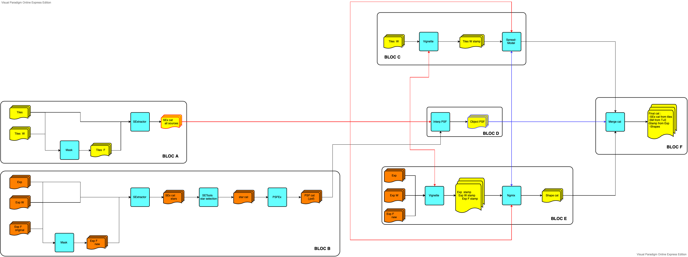
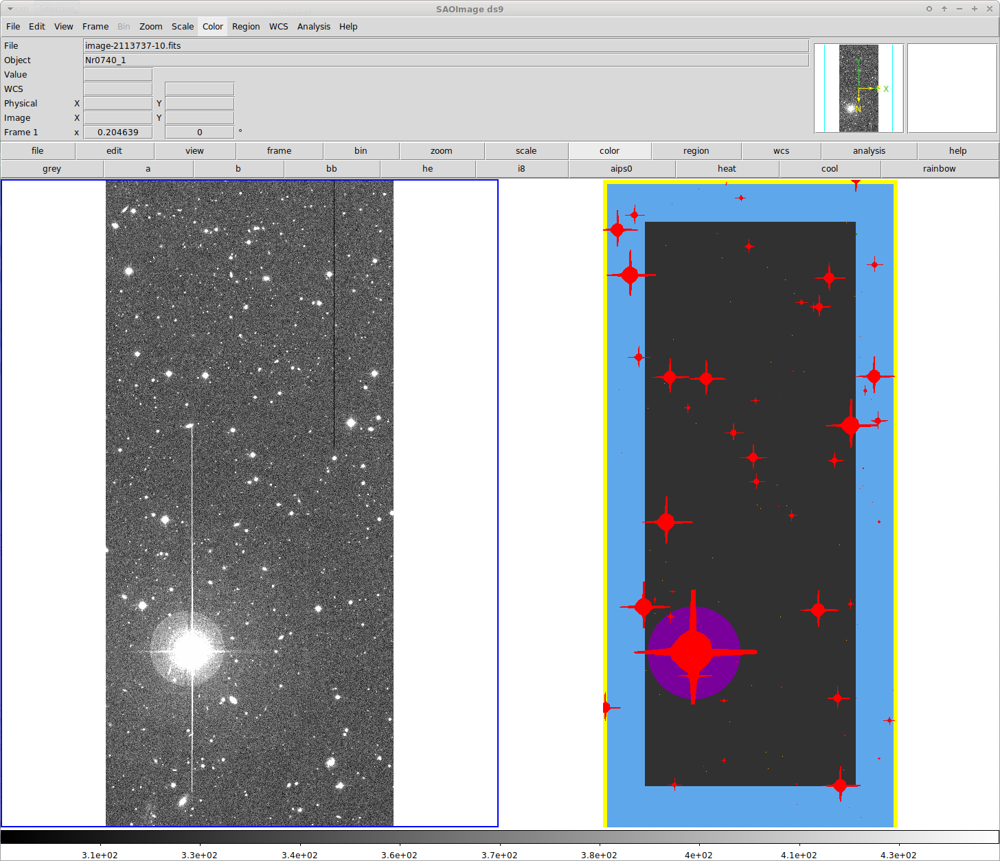
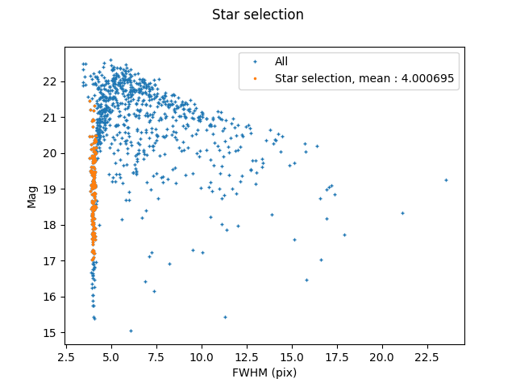
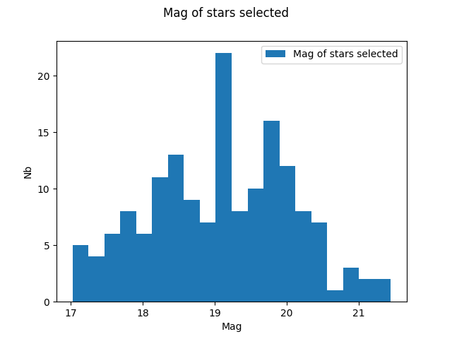
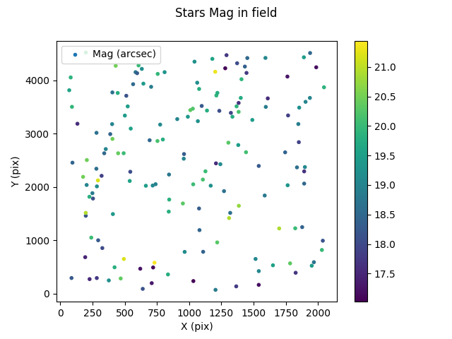
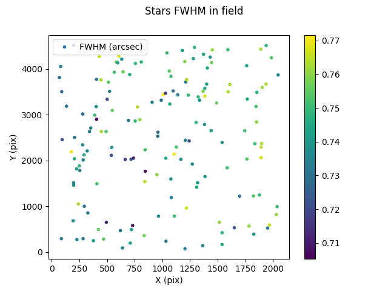
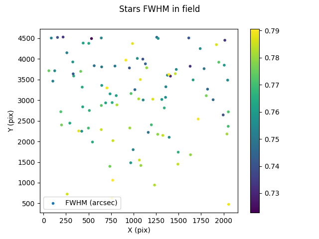
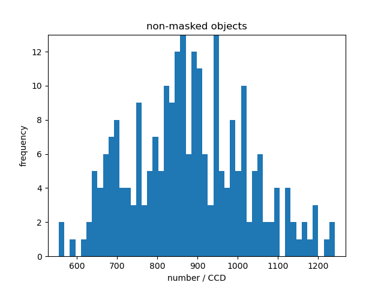
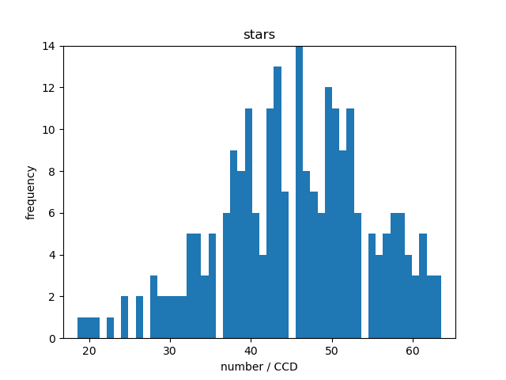
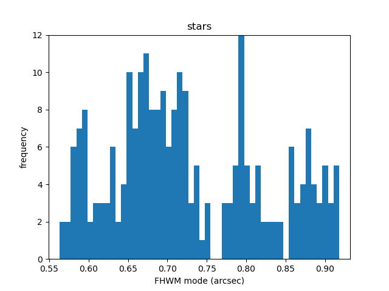

# ShapePipe Tutorial

## Quick start

Production runs go through the [Snakemake workflow](workflow.md). Put the tile
IDs in the file named by `tile_list` in `workflow/config.yaml`, one
`IDra.IDdec` per line, and run

```bash
workflow/bin/sp run
```

A single tile is a legal tile list and is the smallest useful end-to-end run.
The sections below describe what that produces, stage by stage.

## Introduction

The `ShapePipe` pipeline processes single-exposure images and stacked images. Input images have to be calibrated beforehand for astrometry and photometry. This tutorial of an entire `ShapePipe` run covers specifically images from CFIS, the Canada-France Imaging Survey. CFIS stacks are so-called tiles, which are the co-adds of on average three exposures in the r-band.

### File types and names

The `ShapePipe` pipeline handles different image and file types, some of which
are created by the pipeline during the analysis. These file types are listed below.

All files follow a (configurable) naming and numbering convention, to facilitate bookkeeping for
tracking relevant image information. In general, the convention is **<image_type>_<ID>.fits**.
`ID` can be a combination of numbers and special characters such as `-`.
Naming and numbering of the input files can closely follow the original image names and (ID) numbers provided by the telescope and pre-processing software, with some required modifications as described below.

- Single-exposure mosaic image.  
  Multi-HDU FITS file containing a mosaic from multiple CCDs of a single exposure (an exposure is also called epoch).
  Each CCD is stored in a different HDU.
  These files are used on input by `ShapePipe`. The pixel data can contain the observed image, a weight map, or a flag map.
  These images are typically created by a telescope analysis software (e.g.~`pitcairn`). Examples from CFIS are
  `2228303p.fits.fz`, `2214439p.flag.fits.fz`. These names need to be modified to be correctly identified by `ShapePipe`:
  The `p` needs to be removed, the image type needs to precede the ID, and the file name can only contain a single dot (`.`) delimiting the file extension. We create the extension `fitsfz` for compressed FITS file.  
  Default convention: **<image_type>-<exposure_number>.fitsfz**.  
  Examples: `image-2228303.fitsfz`, `flag-2214439.fitsfz`

- Single-exposure single-CCD image.  
  FITS file containing a single CCD from an individual exposure. The pixel data can contain the observed image, a weight
  map, or a flag map.  
  Default convention: **<image_type>-<exposure_number>-<CCD_number>.fits**  
  Examples: `image-2079614-9.fits`, `weight-2079614-3.fits`

- Stacked images  
  FITS file containing a stack by co-adding different single exposures, created by software such as `swarp`.
  A stacked image is also called *tile*. These files are used on input by `ShapePipe`.
  The pixel data can contain the observed image, a weight map, or a flag map. Tile images and weights are created in the
  case of CFIS by Stephen Gwyn using a combination of `swarp` and his own software. Examples of file names are
  `CFIS.316.246.r.fits`, `CFIS.205.267.r.weight.fits.fz`, the latter is a compressed FITS file, see below. Tile flag files
  are created the mask module of `ShapePipe` (see [Mask images](#mask-images)). The tile ID needs to be modified such that the `.` between the two tile numbers (RA and DEC indicator) is not mistaken for a file extension delimiter. For the same reason, the extension `.fits.fz` is changed to `.fitzfz`. In addition, for
  clarity, we include the string `image` for a tile image type.  
  Default convention: **<image_type>-<tile_number>.fits**  
  Examples: `CFIS_image-277-282.fits`, `CFIS_weight-274-282.fitsfz`, `pipeline_flag-239-293.fits`

- Database catalogue files  
  For very large files that combine information from multiple tiles or single exposures, `ShapePipe` creates `sqlite`
  data base catalogues.  
  Examples: `log_exp_headers.sqlite`, exposure header information

- Numpy array binary files  
  Some large files are stored as numpy arrays. These contain FITS header information.
  Example: `headers-2366993.npy`

- PSF files  
  `PSFEx` and `SExtractor` produce FITS files with file exentions other than `.fits`: `.psf` for files containing PSF
  model information for a single CCD, and `.cat` for a PSF catalogue.

- _final_ shape catalogue
  The end product of `ShapePipe` is a _final_ catalogue containing a large number of information for each galaxy, including its
  shape parameters, the ellipticity components :math:`e_1` and :math:`e_2`. This catalogue also contains shapes of artificially
  sheared images. This information is used in post-processing to compute calibrated shear estimates via metacalibration.

- Summary statistic files  
  The `SETools` module that creates samples of objects according to some user-defined selection criteria (see [Select stars](#select-stars)) also outputs ASCII   
  files with user-defined summary statistics for each CCD, for example the number of selected stars, or mean and standard deviation of their FWHM.  
  Example: `star_stat-2366993-18.txt`

- Tile ID list  
  ASCII file with a tile number on each line. Used for the `get_image_runner` module to download CFIS images (see [Download tiles](#download-tiles)).

- Single-exposure name list  
  ASCII file with a single-exposure name on each line. Produced by the `find_exposure_runner` module to identify single exposures that were used to create
  a given tile. See [Find exposures](#find-exposures)).

- Plots  
  The `SETools` module can also produce plots of the objects properties that were selected for a given CCD.
  The type of plot (histogram, scatter plot, ...) and quantities to plot as well as plot decorations can be specified in the
  selection criteria config file (see [Select stars](#select-stars)).
  Example: `hist_mag_stars-2104133-5.png`

- Log files  
  The pipeline core and all called modules write ASCII log files to disk.  
  Examples: `process-2366993-6.log`, `log_sp_exp.log`.

### CFIS processing

`ShapePipe` splits the processing of CFIS images into several parts:
These are the retrieval and preparation of input images, processing of single exposures,
processing of tile images, and creation of _final_ shape catalogues.

The following flowchart visualised the processing parts and steps.



Below, the individual processing steps are described in detail.

### Input and output paths

The workflow's rules export every path a config interpolates before each
`shapepipe_run` call, so nothing here needs setting by hand for a normal run.

If a config file is run outside the workflow, the following variables need to be
defined.
- `$SP_RUN`: Run directory of `ShapePipe`. In general this is just `pwd`, and can be set via
  ```bash
  export SP_RUN=`pwd`
  ```
  but on a cluster this directory might be different.
- `$SP_CONFIG`: Path to configuration files. In our example this is `$SP_BASE/example/cfis`.
- `$SP_UNIT_NUM`: the tile or exposure this run is restricted to, in ShapePipe's
  image-number convention — a leading dash, and dots replaced by dashes (tile
  `210.282` becomes `-210-282`, exposure `2605805` becomes `-2605805`). The
  configs interpolate it into `NUMBER_LIST`.

In addition, the output path `$SP_RUN/output` needs to be created by the user before running `ShapePipe`.

### The rule chain

There is no monolithic job script. Every processing step below is a **rule**, and
every rule instance is one `shapepipe_run` call on one unit — one tile, or one
single exposure — inside that unit's own directory:

| level | rule chain |
| --- | --- |
| tile, prepare phase | `tile_get_images` → `tile_uncompress` → `tile_find_exposures` |
| exposure | `exp_get_images` → `exp_star_cat` → `exp_split` → `exp_mask` → `exp_psf` → `exp_persist` → `exp_footprint` → `clean_exposure` |
| tile, compute phase | `tile_exp_forest` → `tile_merge_headers` → `tile_detect` → `tile_vignets` → `tile_ngmix` → `tile_merge_cats` → `tile_make_cat` → `clean_tile` |

Each rule calls

```bash
shapepipe_run -c $SP_CONFIG/<config>.ini
```

on a config file committed under `workflow/config/cfis/`, containing the
configuration for one or more modules. See [Configuration](configuration.md) for
what goes in one. To run a single rule and its prerequisites and nothing else,
name it as a snakemake target: `sp exp_psf ...`.

Each unit directory holds an `output/` subdirectory with all pipeline outputs
(log files, diagnostics, statistics, output images, catalogues, single-exposure
headers with WCS information), beside the `manifests/` and `logs/` that are the
workflow's own bookkeeping.

### Select tiles

The tiles to process are the lines of the tile list. The campaign grows by
appending to that file: the tile-to-exposure index accumulates across
invocations, so adding tiles later changes which jobs exist without invalidating
completed work.

If the tile IDs are not known a priori, they can be selected via sky coordinates, with the script `cfis_field_select`.
For example, to find the tile number for a Planck cluster at R.A.=213.68 deg, dec=57.79 deg, run:
```bash
cfis_field_select -i /path/to/shapepipe/auxdir/CFIS/tiles_202007/tiles_all_order.txt --coord 213.68deg_54.79deg -t tile --input_format ID_only --out_name_only --out_ID_only -s
```
The input text file (provide via the flag `-i`) contains a list of CFIS tiles, this can also be directory containing the tile FITS files.


The following sections describe the steps the rule chain performs.

## Run the pipeline

### Retrieve input images

`tile_get_images` retrieves the image and weight corresponding to a tile ID
using the module `get_images`. `tile_find_exposures` then identifies the
exposures that were used to create the tile image via the `find_exposures`
runner, and `exp_get_images` retrieves each of those exposures' image, weight
and flag files.

For the retrieval method the user can choose between
- download from VOspace (`RETRIEVE = vos` in the config);
- create symbolic link to existing file on disk (`RETRIEVE = symlink`).

Note that internet access is required for this step if the download method is `vos`.

These three rules are the workflow's PREPARE phase. The exposure half of the run
cannot be scheduled before them, because which exposures exist is something
`find_exposures` has to say first — which is why one run is two snakemake
invocations over one Snakefile (see [the workflow page](workflow.md)).

## Prepare input images

`tile_uncompress` uncompresses the compressed tile weight image via the
`uncompress_fits` module.

`exp_split` splits each single-exposure image, weight and flag into
single-exposure single-CCD files (one FITS file per CCD) with `split_exp`, and
writes that exposure's WCS information to `headers-<exposure_number>.npy`.

`tile_merge_headers` then merges the headers of the exposures overlapping one
tile into a single `sqlite` file, so the tile-side modules can look up the WCS of
any of them.

## Mask images

`exp_mask` masks the single-exposure single-CCD images with the `mask` runner.

Masking needs a reference star catalogue, and no compute node needs internet
access to get one: `star_catalogue` makes one Vizier cone query per HEALPix
chunk of the campaign footprint into a run-independent cache, and `exp_star_cat`
cuts each exposure's catalogue out of that cache with no network at all. Both
are `localrule`s, so the queries run in the head process. Network cost therefore
scales with sky area rather than with exposure count.

There is no `tile_mask` rule: the committed config chain is the unmasked
`tile_detect` variant. Adding the masked variant is a config plus one rule, and
needs a tile-side analogue of `exp_star_cat` — tile star catalogues key on tile
ID, so they are a separate cache namespace.

**Diagnostics:** Open a single-exposure single-CCD image and the corresponding pipeline flag
in `ds9`, and display both frames next to each other. Example
```bash
ds9 image-2113737-10.fits pipeline_flag-2113737-10.fits
```
Choose `zoom fit` for both frames, click `scale zscale` for the image, and `color aips0` for the flag, to display something like this:



By eye the correspondence between the different flag types and the image can be
seen. Note that the two frames might not match perfectly, since (a) WCS
information is not available in the flag file FITS headers; (b) the image can
have a zero-padded pixel border, which is not accounted for by `ds9`.

## Detect objects on tiles and process stars on single exposures

`tile_detect` detects objects on the tile with the `sextractor` runner.

`exp_psf` runs the single-exposure single-CCD chain:
- Objects are detected with `sextractor`.
- Star candidates are selected via `setools`.
- The PSF model is created with `psfex`.
- The PSF model is interpolated to star positions for validation, via a call to
  `psfex_interp`.

The output directory is `run_sp_exp_SxSePsfPi`, holding the output of SExtractor
on the exposures (`Sx`), `setools` (`Se`), the PSF model (`Psf`) and the
validation interpolation (`Pi`).

`exp_persist` then copies the products named by `persist_exp:` in
`workflow/config.yaml` — by default the `validation_psf-*.fits` that the rho and
tau statistics are computed from — off scratch onto the persistent root, before
the purge or `clean_exposure` can take them.

The following plots show an example of a single CCD, in the center of the focal plane.

| Size-magnitude plot | Star magnitude histogram | Stars in CCD (mag) | Stars in CCD (size) |
| --- | --- | --- | --- |
|  |  |  |  |
| The stellar locus is well-defined | Magnitude distribution looks reasonable | Stars are relatively homogeneously distributed over the CCD | The uniform and small seeing of CFHT is evident |

To contrast the last plot, here is the case of the CCD in the lower right corner, which shows a known (but yet unexplained) lack of stars
in the lower parts:



The statistics output file for the center CCD #10:
```bash
cat star_stat-2113737-10.txt
# Statistics
Nb objects full cat = 1267
Nb stars = 160
stars/deg^2 = 6345.70450519073
Mean star fwhm selected (arcsec) = 0.7441293125152588
Standard deviation fwhm star selected (arcsec) = 0.014217643037438393
Mode fwhm used (arcsec) = 0.7345179691314697
Min fwhm cut (arcesec) = 0.7159179691314698
Max fwhm cut (arcsec) = 0.7531179691314697
```

### Global star sample statistics

The statistics on stars from all CCD can be combined to create histograms, with the non-pipeline script `stats_global.py`.
Run
```bash
stats_global -o stats -v -c $SP_CONFIG/config_stats.ini
```
to create histograms (as `.txt` tables and `.png` plots) in the directory `stats`. Here are some example plots :

| Non-masked objects per CCD | Stars per CCD | FWHM mode |
| --- | --- | --- |
|  |  |  |
| No CCD with a very large masked area | No CCD with insufficient stars | Rather broad seeing distribution |

Note that `stats_global` read all `SETool` output stats files found in a given input directory tree. It can thus produce histogram combining
several runs.


## Galaxy selection

`tile_vignets` selects galaxies as extended objects compared to the PSF.
First, the PSF model is interpolated to galaxy positions with `psfex_interp`.
Next, postage stamps around galaxies of the weight maps are created via
`vignetmaker`. Then the spread model is computed by the `spread_model` module.
Finally, postage stamps around galaxies of single-exposure data are extracted
with another call to `vignetmaker` — `Pi`, `Vi`, `Sm`, `Vi`, hence the config
name `config_tile_PiViVi.ini`.

`tile_vignets` reads the exposure products through the symlink forest that
`tile_exp_forest` built for this tile, and is the last stage that touches them:
once every consuming tile has its vignets, an exposure store becomes
reclaimable.


## Shape measurement

`tile_ngmix` computes galaxy shapes using the multi-epoch model-fitting method
`ngmix`. At the same time, shapes of artificially sheared galaxies are obtained
for metacalibration.

Shape measurement is split into parallel chunks: `ngmix_chunks:` in
`workflow/config.yaml` sets how many, and each chunk is its own rule instance
writing its own `run_sp_tile_ngmix_Ng<X>u` output directory.


## Paste catalogues

`tile_merge_cats` merges the parallel `ngmix` output files from the previous
step into one file with `merge_sep`, in `run_sp_Ms`.

`tile_make_cat` then pastes the previously obtained information into a _final_
shape catalogue via `make_cat`, in `run_sp_Mc`. Included are galaxy detection
and basic measurement parameters, the PSF model at galaxy positions, the
spread-model classification, and the shape measurement. The rule publishes that
catalogue onto the persistent root as
`<products_dir>/tiles/<prefix>/<ID>/final_cat-<ID>.fits` — the campaign's
product, and also the marker that says this tile is finished.
