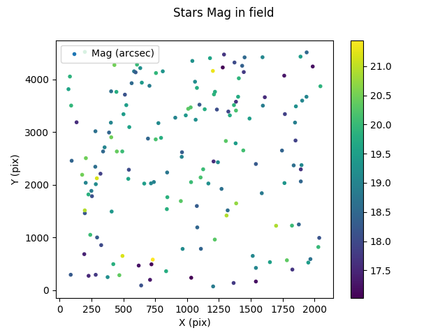

# ShapePipe Tutorial

## Quick start

Run the entire pipeline on a single example CFIS image with tile ID 246.290:
1. [Install](https://github.com/cosmostat/shapepipe#installing-shapepipe) `ShapePipe` and activate the `shapepipe` conda environment.
3. Run the job script
```bash
job_sp 246.290 -j 127
```

## Introduction

The `ShapePipe` pipeline processes single-exposure images and stacked images. Input images have to be calibrated beforehand for astrometry and photometry. This tutorial of an entire `ShapePipe` run covers specifically images from CFIS, the Canada-France Imaging Survey. CFIS stacks are so-called tiles, which are the co-adds of on average three exposures in the r-band.

### File types and names

The `ShapePipe` pipeline handles different image and file types, some of which
are created by the pipeline during the analysis. These file types are listed below.

All files follow a (configurable) naming and numbering convention, to facilitate bookkeeping for
tracking relevant image information. In general, the convention is **<image_type>_<ID>.fits**.
`ID` can be a combination of numbers and special characters such as `-`.
Naming and numbering of the input files can closely follow the original image names and (ID) numbers provided by the telescope and pre-processing software, with some required modifications as described below.

- Single-exposure mosaic image.  
  Multi-HDU FITS file containing a mosaic from multiple CCDs of a single exposure (an exposure is also called epoch).
  Each CCD is stored in a different HDU.
  These files are used on input by `ShapePipe`. The pixel data can contain the observed image, a weight map, or a flag map.
  These images are typically created by a telescope analysis software (e.g.~`pitcairn`). Examples from CFIS are
  `2228303p.fits.fz`, `2214439p.flag.fits.fz`. These names need to be modified to be correctly identified by `ShapePipe`:
  The `p` needs to be removed, the image type needs to precede the ID, and the file name can only contain a single dot (`.`) delimiting the file extension. We create the extension `fitsfz` for compressed FITS file.  
  Default convention: **<image_type>-<exposure_number>.fitsfz**.  
  Examples: `image-2228303.fitsfz`, `flag-2214439.fitsfz`

- Single-exposure single-CCD image.  
  FITS file containing a single CCD from an individual exposure. The pixel data can contain the observed image, a weight
  map, or a flag map.  
  Default convention: **<image_type>-<exposure_number>-<CCD_number>.fits**  
  Examples: `image-2079614-9.fits`, `weight-2079614-3.fits`

- Stacked images  
  FITS file containing a stack by co-adding different single exposures, created by software such as `swarp`.
  A stacked image is also called *tile*. These files are used on input by `ShapePipe`.
  The pixel data can contain the observed image, a weight map, or a flag map. Tile images and weights are created in the
  case of CFIS by Stephen Gwyn using a combination of `swarp` and his own software. Examples of file names are
  `CFIS.316.246.r.fits`, `CFIS.205.267.r.weight.fits.fz`, the latter is a compressed FITS file, see below. Tile flag files
  are created the mask module of `ShapePipe` (see [Mask images](#mask-images)). The tile ID needs to be modified such that the `.` between the two tile numbers (RA and DEC indicator) is not mistaken for a file extension delimiter. For the same reason, the extension `.fits.fz` is changed to `.fitzfz`. In addition, for
  clarity, we include the string `image` for a tile image type.  
  Default convention: **<image_type>-<tile_number>.fits**  
  Examples: `CFIS_image-277-282.fits`, `CFIS_weight-274-282.fitsfz`, `pipeline_flag-239-293.fits`

- Database catalogue files  
  For very large files that combine information from multiple tiles or single exposures, `ShapePipe` creates `sqlite`
  data base catalogues.  
  Examples: `log_exp_headers.sqlite`, exposure header information

- Numpy array binary files  
  Some large files are stored as numpy arrays. These contain FITS header information.
  Example: `headers-2366993.npy`

- PSF files  
  `PSFEx` and `SExtractor` produce FITS files with file exentions other than `.fits`: `.psf` for files containing PSF
  model information for a single CCD, and `.cat` for a PSF catalogue.

- _final_ shape catalogue
  The end product of `ShapePipe` is a _final_ catalogue containing a large number of information for each galaxy, including its
  shape parameters, the ellipticity components :math:`e_1` and :math:`e_2`. This catalogue also contains shapes of artificially
  sheared images. This information is used in post-processing to compute calibrated shear estimates via metacalibration.

- Summary statistic files  
  The `SETools` module that creates samples of objects according to some user-defined selection criteria (see [Select stars](#select-stars)) also outputs ASCII   
  files with user-defined summary statistics for each CCD, for example the number of selected stars, or mean and standard deviation of their FWHM.  
  Example: `star_stat-2366993-18.txt`

- Tile ID list  
  ASCII file with a tile number on each line. Used for the `get_image_runner` module to download CFIS images (see [Download tiles](#download-tiles)).

- Single-exposure name list  
  ASCII file with a single-exposure name on each line. Produced by the `find_exposure_runner` module to identify single exposures that were used to create
  a given tile. See [Find exposures](#find-exposures)).

- Plots  
  The `SETools` module can also produce plots of the objects properties that were selected for a given CCD.
  The type of plot (histogram, scatter plot, ...) and quantities to plot as well as plot decorations can be specified in the
  selection criteria config file (see [Select stars](#select-stars)).
  Example: `hist_mag_stars-2104133-5.png`

- Log files  
  The pipeline core and all called modules write ASCII log files to disk.  
  Examples: `process-2366993-6.log`, `log_sp_exp.log`.

### CFIS processing

`ShapePipe` splits the processing of CFIS images into several parts:
These are the retrieval and preparation of input images, processing of single exposures,
processing of tile images, creation and upload (optional) of _final_ shape catalogues.

The following flowchart visualised the processing parts and steps.


Below, the individual processing steps are described in detail.

### Input and output paths

All required paths are automatically set in the job script `job_sp`.

If an example config file is run outside this script,
the following path variables might need to be defined.
- `$SP_RUN`: Run directory of `ShapePipe`. In general this is just `pwd`, and can be set via
  ```bash
  export SP_RUN=`pwd`
  ```
  but on a cluster this directory might be different.
- `$SP_CONFIG`: Path to configuration files. In our example this is `$SP_BASE/example/cfis`.

In addition, the output path `$SP_RUN/output` needs to be created by the user before running `ShapePipe`.

### Job and pipeline scripts

The job script to run the pipeline in its entity or in parts is `job_sp[.bash]`. Type
```bash
job_sp -h
```
for all options.

This script creates the subdirectory `$SP_RUN/output` to store all pipeline outputs
(log files, diagnostics, statistics, output images, catalogues, single-exposure headers with WCS information).

Optionally, the subdir `output_star_cat` is created by the used to store the external star catalogues for masking. This is only necessary if the pipeline is run on a cluster without internet connection to access star catalogues. In that case, the star catalogues need to be retrieved outside the pipeline, for example on a login node, and copied to `output_star_cat`.

The job script automaticall performs a number of subsequent calls to the `ShapePipe` executable `shapepipe_run`, as
```bash
shapepipe_run -c $SP_CONFIG/<config>.ini
```
The config file `<config>.ini` contains the configuration for one or more modules.
See the main `ShapePipe` readme for more details.

The user specifies which steps are run with the command line option `-j JOB`. The integer value `JOB`
is bit-coded such that arbitrary combinations of steps can be run with a single call to `job_sp`. For
example, to run steps #1 and #2, type `job_sp -j 3`.

### Select tiles

To run the job script, one or more CFIS tiles need to be chosen. If the tile IDs are known, they are provided to `job_sp` on the command line.

If the tile IDs are not known a priori, they can be selected via sky coordinates, with the script `cfis_field_select`.
For example, to find the tile number for a Planck cluster at R.A.=213.68 deg, dec=57.79 deg, run:
```bash
cfis_field_select -i /path/to/shapepipe/auxdir/CFIS/tiles_202007/tiles_all_order.txt --coord 213.68deg_54.79deg -t tile --input_format ID_only --out_name_only --out_ID_only -s
```
The input text file (provide via the flag `-i`) contains a list of CFIS tiles, this can also be directory containing the tile FITS files.


The following sections describe the different steps that are performed with `job_sp`.

## Run the pipeline

### Retrieve input images

The command
```bash
job_sp TILE_ID -j 1
```
retrieves the image and weight corresponding to TILE_ID using the module `get_images`.
It then identifies the exposures that were used to create the tile image via the `find_exposures` runner.
Finally, another call to `get_images` retrieves the exposure images, weights, and flag files.

For the retrieval method the user can choose betwen
- download from VOspace (`-r vos`);
- create symbolic link to existing file on disk (`-r symlink`).

Note that internet access is required for this step if the download method is `vos`.

An output directory `run_sp_GitFeGie` (in `output`) is created containing the results of `get_images` for tiles (`Git`),
`find_exposures` (`Fe`), and `get_images` for exposures (`Gie`).

## Prepare input images

With
```bash
job_sp TILE_ID -j 2
```
the compressed tile weight image is uncompressed via the `uncompress_fits` module. Then, the single-exposure images, weight, and flags are split into single-exposure single-CCD file
(one FITS file per CCD) with `split_exp`.
Finally, the headers of all single-exposure single-CCD files are merged into a single `sqlite` file, to store the WCS information of the input exposures.

Two output directories are created, `run_sp_Uz` for `uncompress_fits`, and `run_sp_exp_SpMh` for the output of the modules
`split_exp` (`Sp`) and `merge_headers` (`Mh`).

## Mask images

Run
```bash
job_sp TILE_ID -j 4
```
to mask tile and single-exposure single-CCD images. Both tasks are performed by two calls to the `mask` runner.

Note that internet access is required for this step, since a reference star catalogue is downloaded.

The output of both masking runs are stored in the output directory `run_sp_MaMa`, with run 1 (2) of
`mask` corresponding to tiles (exposures).

**Diagnostics:** Open a single-exposure single-CCD image and the corresponding pipeline flag
in `ds9`, and display both frames next to each other. Example
```bash
ds9 image-2113737-10.fits pipeline_flag-2113737-10.fits
```
Choose `zoom fit` for both frames, click `scale zscale` for the image, and `color aips0` for the flag, to display something like this:


By eye the correspondence between the different flag types and the image can be
seen. Note that the two frames might not match perfectly, since (a) WCS
information is not available in the flag file FITS headers; (b) the image can
have a zero-padded pixel border, which is not accounted for by `ds9`.

## Detect objects on tiles and process stars on single exposures

The call
```bash
job_sp TILE_ID -j 8
```
performs a number of steps. First, objects on the tiles are deteced with the `sextractor` runner.
Next, the following tasks are run on the single-exposure single-CCD images:
- Objects are deteced with `sextractor`.
- Star candidates are selected via `setools`.
- The PSF model is created, either with `psfex` for PSFex, or
  with `mccd_preprocessing` and `mccd_fit_val` for MCCD.
- The PSF model is interpolated to star positions for validation. For the PSFEx model, this is done
  via a call to `psfex_interp`. For MCCD, the modules `merge_starcat`, `mccd_plots`, and
  `mccd_interp` are called.

The output directory for both the `mccd` and `psfex` options is `run_sp_tile_Sx_exp_SxSePsf`.
This stores the output of SExtractor on the tiles (`tile_Sx`), on the exposures (`exp_Sx`),
`setools` (`Se`), and the Psf model (`Psf`).  

The following plots show an example of a single CCD, in the center of the focal plane.

| Size-magnitude plot | Star magnitude histogram | Stars in CCD (mag) | Stars in CCD (size) |
| --- | --- | --- | --- |
|  |  |  |  |
| The stellar locus is well-defined | Magnitude distribution looks reasonable | Stars are relatively homogeneously distributed over the CCD | The uniform and small seeing of CFHT is evident |

To contrast the last plot, here is the case of the CCD in the lower right corner, which shows a known (but yet unexplained) lack of stars
in the lower parts:


The statistics output file for the center CCD #10:
```bash
cat star_stat-2113737-10.txt
# Statistics
Nb objects full cat = 1267
Nb stars = 160
stars/deg^2 = 6345.70450519073
Mean star fwhm selected (arcsec) = 0.7441293125152588
Standard deviation fwhm star selected (arcsec) = 0.014217643037438393
Mode fwhm used (arcsec) = 0.7345179691314697
Min fwhm cut (arcesec) = 0.7159179691314698
Max fwhm cut (arcsec) = 0.7531179691314697
```

### Global star sample statistics

The statistics on stars from all CCD can be combined to create histograms, with the non-pipeline script `stats_global.py`.
Run
```bash
stats_global -o stats -v -c $SP_CONFIG/config_stats.ini
```
to create histograms (as `.txt` tables and `.png` plots) in the directory `stats`. Here are some example plots :

| Non-masked objects per CCD | Stars per CCD | FWHM mode |
| --- | --- | --- |
|  |  |  |
| No CCD with a very large masked area | No CCD with insufficient stars | Rather broad seeing distribution |

Note that `stats_global` read all `SETool` output stats files found in a given input directory tree. It can thus produce histogram combining
several runs.


## Galaxy selection

The focus of the next step,
```bash
job_sp TILE_ID -j 16
```
is the selection of galaxies as extended objects compared to the PSF.
First, the PSF model is interpolated to galaxy positions, according to the PSF model
with `psfex_interp` or `mccd_interp`. Next, postage stamps around galaxies
of the weights maps are created via `vignetmaker`. Then, the spread model
is computed by the `spread_model` module. Finally, postage stamps
around galaxies of single-exposure data is extracted with another call
to `vignetmaker`.

The output directory is
- `run_sp_MiViSmVi` if the PSF model is `mccd`;
- `run_sp_tile_PsViSmVi` for the `PSFEx` PSF model.

This corresponds to the MCCD/PSFex interpolation (`Mi`/`Pi`), `vignetmaker` (`Vi`), `spread_model` (`Sm`), and the
second call to `vignetmaker` (`Vi`).


## Shape measurement

The call
```bash
job_sp TILE_ID -j 32
```
computes galaxy shapes using the multi-epoch model-fitting method `ngmix`. At the same time,
shapes of artifically sheared galaxies are obtained for metacalibration.

Shape measurement is performed in parallel for each tile, the number of processes can be specified
by the user with the option `--nsh_jobs NJOB`. This creates `NJOB` output directories `run_sp_tile_ngmix_Ng<X>u`.
with `X` = 1 ... `NJOB` containing the result of `ngmix`.


## Paste catalogues

The last real processing step is
```bash
job_sp TILE_ID -j 64
```
This task first merges the `NJOB` parallel `ngmix` output files from the previous step into
one output file. Then, previously obtained information are pasted into a _final_ shape catalogue via `make_cat`.
Included are galaxy detection and basic measurement parameters, the PSF model at
galaxy positions, the spread-model classification, and the shape measurement.

Two output directories are created. 
The first one is `run_sp_Ms` for the `merge_sep` run.
The second is `run_sp_Mc` for the `make_cat` task; the name is the same for both the `MCCD` and `PSFEx` PSF model.


## Upload results

Optionally, after the pipeline is finished, results can be uploaded to VOspace via
```bash
job_sp TILE_ID -j 128
```

