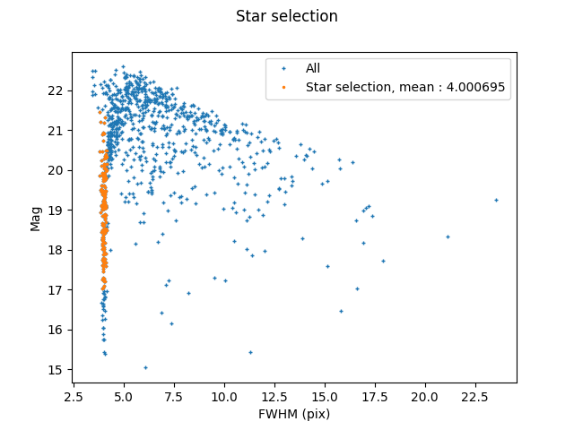

[Home](./shapepipe.md)

# ShapePipe tutorial

## Index

1. [Quick start](#quick-start)
1. [Introduction](#introduction)
    1. [File types and names](#file-types-and-names)
    1. [CFIS processing](#cfis-processing)
    1. [Running the pipeline](#running-the-pipeline)
    1. [Path variables](#path-variables)
1. [Retrieve input images](#retrieve-input-images)
    1. [Select tiles](#select-tiles)
    1. [Retrieve tiles](#retrieve-tiles)
    1. [Uncompress tile weights](#uncompress-tile-weights)
    1. [Find single exposures](#find-single-exposures)
    1. [Retrieve single exposure](#retrieve-single-exposures)
1. [Process single exposure images](#process-single-exposure-images)
    1. [Split images](#split-images)
    1. [Merge WCS headers](#merge-wcs-headers)
    1. [Mask images](#mask-images)
    1. [Extract sources](#extract-sources)
    1. [Select stars](#select-stars)
    1. [Create PSF model](#create-psf-model)
    1. [Validation tests](#validation-tests)
1. [Process stacked images](#process-stacked-images)
    1. [Mask stacks](#mask-stacks)
    1. [Extract sources on stacks](#extract-sources-on-stacks)
    1. [Interpolate multi-epoch PSF](#interpolate-multi-epoch-psf)
    1. [Create weight postage stamps](#create-weight-postage-stamps)
    1. [Compute spread model](#compute-spread-model)
    1. [Create single-exposure postage stamps](#create-single-exposure-postage-stamps)
    1. [Multi-epoch shape measurement with ngmix](#multi-epoch-shape-measurement-with-ngmix)
    1. [Create final catalog](#create-final-catalog)

## Quick start

Run the pipeline on a single example CFIS image:
1. Download and un-tar the
   [example data](https://drive.google.com/file/d/1AowB2_XJtoOI8eB21cKeQhhh3_8mDEHw/view?usp=sharing).
   The file size is 4.1 Gb, this might take a while. This data consists of a single CFIS tile image and weight, and all contributing exposure
   images, weights, and flag FITS files.
   Note that these files represent unpublished, sensitive pixel data, which according to [CFIS rules](https://www.cfht.hawaii.edu/Science/CFIS/cfisaccess.html) should not be downloaded outside of France or Canada, and not be shared with non-CFIS members.
2. [Install](https://github.com/cosmostat/shapepipe#installing-shapepipe) `ShapePipe` under the `photoz` branch, and activate the `shapepipe` conda environment.
3. Run the tutorial
```bash
/path/to/shapepipe/scripts/sh/tutorial_sp_shear_individual.sh -r symlink 246.290
```

At the moment the tutorial is implemented up to shape measurement.
The script is running with the following set-up:
- interactive on the [canfar VM](https://github.com/CosmoStat/shapepipe/blob/master/docs/wiki/canfar.md#interactive-mode) (use ShapePipe path `-b ~/shapepipe`)


## Introduction

The `ShapePipe` pipeline processes single-exposure images and stacked images. Input images have to be calibrated beforehand for astrometry and photometry. This tutorial of an entire `ShapePipe` run covers specifically images from CFIS, the Canada-France Imaging Survey. CFIS stacks are so-called tiles, which are the co-adds of on average three exposures in the r-band.

### File types and names

The `ShapePipe` pipeline handles different image and file types, some of which
are created by the pipeline during the analysis. These file types are listed below.

All files follow a (configurable) naming and numbering convention, to facilitate bookkeeping for
tracking relevant image information. In general, the convention is **<image_type>_<ID>.fits**.
`ID` can be a combination of numbers and special characters such as `-`.
Naming and numbering of the input files can closely follow the original image names and (ID) numbers provided by the telescope and pre-processing software, with some required modifications as described below.

- Single-exposure mosaic image.  
  Multi-HDU FITS file containing a mosaic from multiple CCDs of a single exposure (an exposure is also called epoch).
  Each CCD is stored in a different HDU.
  These files are used on input by `ShapePipe`. The pixel data can contain the observed image, a weight map, or a flag map.
  These images are typically created by a telescope analysis software (e.g.~`pitcairn`). Examples from CFIS are
  `2228303p.fits.fz`, `2214439p.flag.fits.fz`. These names need to be modified to be correctly identified by `ShapePipe`:
  The `p` needs to be removed, the image type needs to precede the ID, and the file name can only contain a single dot (`.`) delimiting the file extension. We create the extension `fitsfz` for compressed FITS file.  
  Default convention: **<image_type>-<exposure_number>.fitsfz**.  
  Examples: `image-2228303.fitsfz`, `flag-2214439.fitsfz`
  
- Single-exposure single-CCD image.  
  FITS file containing a single CCD from an individual exposure. The pixel data can contain the observed image, a weight
  map, or a flag map.  
  Default convention: **<image_type>-<exposure_number>-<CCD_number>.fits**  
  Examples: `image-2079614-9.fits`, `weight-2079614-3.fits`

- Stacked images  
  FITS file containing a stack by co-adding different single exposures, created by software such as `swarp`.
  A stacked image is also called *tile*. These files are used on input by `ShapePipe`.
  The pixel data can contain the observed image, a weight map, or a flag map. Tile images and weights are created in the
  case of CFIS by Stephen Gwyn using a combination of `swarp` and his own software. Examples of file names are
  `CFIS.316.246.r.fits`, `CFIS.205.267.r.weight.fits.fz`, the latter is a compressed FITS file, see below. Tile flag files
  are created the mask module of `ShapePipe` (see [Mask images](#mask-images)). The tile ID needs to be modified such that the `.` between the two tile numbers (RA and DEC indicator) is not mistaken for a file extension delimiter. For the same reason, the extension `.fits.fz` is changed to `.fitzfz`. In addition, for
  clarity, we include the string `image` for a tile image type.  
  Default convention: **<image_type>-<tile_number>.fits**  
  Examples: `CFIS_image-277-282.fits`, `CFIS_weight-274-282.fitsfz`, `pipeline_flag-239-293.fits`
    
- Database catalogue files  
  For very large files that combine information from multiple tiles or single exposures, `ShapePipe` creates `sqlite`
  data base catalogues.  
  Examples: `log_exp_headers.sqlite`, exposure header information
  
- Numpy array binary files  
  Some large files are stored as numpy arrays. These contain FITS header information. 
  Example: `headers-2366993.npy`
  
- PSF files  
  `PSFEx` and `SExtractor` produce FITS files with file exentions other than `.fits`: `.psf` for files containing PSF
  model information for a single CCD, and `.cat` for a PSF catalogue.
  
- Summary statistic files  
  The `SETools` module that creates samples of objects according to some user-defined selection criteria (see [Select stars](#select-stars)) also outputs ASCII   
  files with user-defined summary statistics for each CCD, for example the number of selected stars, or mean and standard deviation of their FWHM.  
  Example: `star_stat-2366993-18.txt`
  
- Tile ID list
  ASCII file with a tile number on each line. Used for the `get_image_runner` module to download CFIS images (see [Download tiles](#download-tiles)).
  
  - Single-exposure name list
    ASCII file with a single-exposure name on each line. Produced by the `find_exposure_runner` module to identify single exposures that were used to create
    a given tile. See [Find exposures](#find-exposures)).
  
- Plots
  The `SETools` module can also produce plots of the objects properties that were selected for a given CCD.
  The type of plot (histogram, scatter plot, ...) and quantities to plot as well as plot decorations can be specified in the
  selection criteria config file (see [Select stars](#select-stars)).
  Example: `hist_mag_stars-2104133-5.png`
  
- Log files
  The pipeline core and all called modules write ASCII log files to disk.  
  Examples: `process-2366993-6.log`, `log_sp_exp.log`. 
  
### CFIS processing

`ShapePipe` splits the processing of CFIS images into three parts:  
1.) [Retrieve and prepare input images](#retrieve-and-prepare-input-images)  
2.) [Process single exposure images](#process-single-exposure-images)  
3.) [Process stacked images](#process-stacked-images)    

The following flowchart visualised the processing parts and steps.


Below, the individual processing steps are described in detail.

### Path variables

The following path variables need to be defined where `ShapePipe` is to be run. If this is done via job submission on a cluster, these variables need to be communicated to the job environment.
- `$SP_RUN`: Run directory of `ShapePipe`. In general this is just `pwd`, and can be set via
  ```bash
  export SP_RUN=`pwd`
  ```
  but on a cluster this directory might be different.
- `SP_BASE`: Not required, but for convenience define this path to point at `/path/to/shapepipe/example/tutorial`.
- `$SP_CONFIG`: Path to configuration files. In our example this is `$SP_BASE/example/tutorial`.

### Running the pipeline

See the main `ShapePipe` readme for more details.

In `$SP_RUN` the following subdirectory `output` needs to be created by the user, to store all pipeline output
(log files, diagnostics, statistics, output images, catalogues, single-exposure headers with WCS information).
Optionally, the subdir `output_star_cat` is created by the used to store the external star catalogues for masking. This is only necessary if the pipeline is run on a cluster without internet connection to access star catalogues. In that case, the star catalogues need to be retrieved outside the pipeline, for example on a login node, and copied to `output_star_cat`.

In general, a call to the pipeline is done as follows, after activating the `shapepipe` conda environment (indicated by `(shapepipe)` at the beginning of the shell prompt.
```bash
shapepipe_run -c $SP_CONFIG/<config>.ini
```
The config file `<config>.ini` contains the configuration for one or more modules.


## Retrieve input images

Before running `ShapePipe` we need to select the tiles to be processed.

### Select tiles

The result of this selection is a text file with a tile IDs on each line, in the form `XYZ.ABC`. If the ID(s) are known in advance, this can be done by hand, e.g.
```bash
echo 002.240 > tile_numbers.txt
```

If this is not the case, tiles can be selected to by sky coordinates, with the script `cfis_field_select`.
For example, to find the tile number for a Planck cluster at R.A.=213.68 deg, dec=57.79 deg, run:
```bash
cfis_field_select -i $SP_BASE/aux/CFIS/tiles_202007/tiles_all_order.txt --coord 213.68deg_54.79deg -t tile --input_format ID_only --out_name_only --out_ID_only -s -o tile_numbers
```
The input text file (with `-i`) contains a list of CFIS tiles, this can also be directory containing the tile FITS files.

To select tiles covering an entire sky area, for example CFHTLS-W3, do:
```bash
cfis_field_select -i /path/to/shapepipe/aux/CFIS/tiles_202007/tiles_all_order.txt --area 208deg_50.75deg_221.deg_58deg -v --input_format ID_only --out_name_only --out_ID_only -s -o tile_numbers --plot
```

Now we are ready to run the first, pre-processing `ShapePipe` modules.

### Retrieve tiles

**Module:** get_image_runner  
**Parent:**  none  
**Input:** tile ID list  
**Output:** tile image, compressed tile weight

The tile images and weights selected in the previous section will be retrieved now, by running the module `get_image_runner`. This module either downloads the images or, if they already exist on a local hard disk, creates symbolic links. Downloading uses the Virtual Observatory VOSpace (vos) software (http://www.ivoa.net/documents/VOSpace). The downloaded files (or link names) are then modified to be parsable by the pipeline.

An example config file is `SP_CONFIG/config_tile_Git.ini`.
The module section `[GET_IMAGES_RUNNER]` first contains the input tile ID list file path (default is `tile_numbers.txt`). This is assembled from `FILE_PATTERN`, `FILE_EXT`, and `NUMBERING_SCHEME`. Since there
is only a single input text file with no number, the latter entry is empty. See see `File options` in the [general pipeline readme](README.rst)) for more details on the numbering scheme.

Next, we need to specify for the images input path (for example a VOS url),
input file pattern and their extension. The entry `INPUT_FILE_PATTERN` includes the
tile ID(s) as  dummy template, similarly to the `NUMBERING_SCHEME`. In
addition, the input numbering scheme as python `regexp` needs to be specified
by `INPUT_NUMBERING`, which matches the tile number in the tile number list. To
summarize, `INPUT_FILE_PATTERN` needs to match the file name to be
downloaded/linked. `INPUT_NUMBERING` needs to match the ID numbers in the tile
ID list text file `tile_numbers.txt`.

Next, the output file pattern without the tile number is specified in the config file. Here this needs to
be different from the original image names to be consistent with the `ShapePipe` naming conventions, e.g.~no
dots other than for the file extension.

After that we name the copy or download method, for example `vos`. Additional command options can be indicated with the key `COPY_OPTIONS`. Here is the example:
```ini
[GET_IMAGES_RUNNER]
FILE_PATTERN = tile_numbers
FILE_EXT = .txt
NUMBERING_SCHEME =
INPUT_PATH = vos:cfis/tiles_DR2, vos:cfis/tiles_DR2
INPUT_FILE_PATTERN = CFIS.000.000.r, CFIS.000.000.r.weight
INPUT_FILE_EXT = .fits, .fits.fz
INPUT_NUMBERING = \d{3}\.\d{3}
OUTPUT_FILE_PATTERN = CFIS_image-, CFIS_weight-
COPY = vos
```

On success, tile images and compressed tile weights are created, either as physical files or symbolic links.

### Uncompress tile weights

**Module:** uncompress_fits_images_runner  
**Parent:**  get_image_runner    
**Input:** compressed tile weight  
**Output:** tile weight

The compressed stack weights (.fits.fz/.fitsfz files) need to be uncompressed before further processing. An example config file is `$SP_CONFIG/config_unfz_w.ini`. Except from the input file pattern and extension (see `File Options` in the [general pipeline readme](README.rst)), we need to specify the output file patern (can be the same as the input), and the HDU number of the weight image data:
```ini
[UNCOMPRESS_FITS_IMAGE_RUNNER]
FILE_PATTERN = CFIS_weight
FILE_EXT = .fitsfz
OUTPUT_PATTERN = CFIS_weight
HDU_DATA = 1
```

On success, the uncompressed weight image with the correct (only) HDU is written.

### Find single exposures

**Module:** find_exposures_runner  
**Parent:**  get_image_runner    
**Input:** tile image  
**Output:** single-exposure name list

Once the resulting tiles and weight images are downloaded, we need to identify the exposure images that where co-added to produce the tiles. These can be found in the tile FITS header. The example config file `$SP_CONFIG/config_tile_Fe.ini` has as entries the
information for the input tiles, which are input directoy (last run of get_images) and file names:
```
[FIND_EXPOSURE_RUNNER]
INPUT_DIR = last:get_images_runner
FILE_PATTERN = CFIS_image
FILE_EXT = .fits
NUMBERING_SCHEME = -000-000
```

On success, the ascii files with the single-exposure names are produced.


### Retrieve single exposures

**Module:** get_image_runner2  
**Parent:**  find_exposure_runner  
**Input:** single-exposure name list  
**Output:** tile image, compressed tile weight

This process works as the one to download tiles, see [Download tiles](#download-tiles). The single-exposure names are read from the output ascii file of the previous module (`find-exposure-runner`). Single-exposure images, weights, and flags are retrieved. Here is the example `$SP_CONFIG/config_tile_Gie.ini` relevant section:
```ini
[GET_IMAGES_RUNNER2]
INPUT_DIR = last:find_exposures_runner
FILE_PATTERN = exp_numbers
FILE_EXT = .txt
NUMBERING_SCHEME = -000-000 
INPUT_PATH = vos:cfis/pitcairn, vos:cfis/weights, vos:cfis/flags
INPUT_FILE_PATTERN = 000000, 000000.weight, 000000.flag
INPUT_FILE_EXT = .fits.fz, .fits.fz, .fits.fz
INPUT_NUMBERING = \d{6}
OUTPUT_FILE_PATTERN = image-, weight-, flag-
RETRIEVE = vos
```

On sucess, single-exposure images, weights, and flags are downloaded, or links to existing files are created.

To perform the pre-processing steps detailed above, we can either run them module by module:
```bash
shapepipe_run -c $SP_CONFIG/config_tile_Git.ini
shapepipe_run -c $SP_CONFIG/config_tile_Uz.ini
shapepipe_run -c $SP_CONFIG/config_tile_Fe.ini
shapepipe_run -c $SP_CONFIG/config_tile_Gie.ini
```
or in one go:
```bash
shapepipe_run -c $SP_CONFIG/config_tile_GitUzFeGie.ini
```
This ends the pre-processing, now we can proceed to the actual (parallel) image processing.

## Process single exposure images

Single exposures can be processed via a single run of `ShapePipe`, which calls all required modules one after another. The corresponding example config file is `$SP_CONFIG/config_exp.ini`, and the command is simply
```bash
shapepipe_run -c $SP_CONFIG/config_exp.ini
```
Alternatively each module can be executed by a separate `ShapePipe` call. The corresponding single-module example config files are detailed in the sections below.

### Split images

**Module:** split_exp_runner   
**Parent:**  get_images_runner2  
**Input:** single-exposure images, weights, flags  
**Output:** single_exposure single-CCD files for input images, weights, flags; SQL files with single-exposure header information

The first step of single-exposure processing is to split the single-exposures images into
files that contain one CCD each.

The example config file is `$SP_CONFIG/config_split_exp.ini`.
On input, we need to specify the three input types (images, weights, flags),
and their extensions. On output, the same three file types are required.
And we specify the number of CCDs, which for MegaCAM CCDs is 40:
```ini
[SPLIT_EXP_RUNNER]
INPUT_DIR = last:get_images_runner2
NUMBERING_SCHEME = -0000000
FILE_PATTERN = image, weight, flag
FILE_EXT = .fitsfz, .fitsfz, .fitsfz
OUTPUT_SUFFIX = image, weight, flag
N_HDU = 40
```

On success, files according to the three output types are created. In addition, the FITS headers of all input
single-exposure images are written to the same output directory, as SQL numpy files. The main purpose
is to save the image WCS information for quick access lateron.

### Merge WCS headers

**Module:** merge_headers_runner  
**Parent:** split_exp_runner  
**Input:** SQL files with single-exposure header information   
**Output:** single SQL file with combined header information  

This pipeline module merges the WCS information (image
transformation and distortions, computed during astrometrical calibration)
for each CCD. At the end, this information has to be merged back into a single file.

The example config file is `$SP_CONFIG/config_exp_Mh.ini`:
```ini
[MERGE_HEADERS_RUNNER]
INPUT_DIR = last:split_exp_runner
FILE_PATTERN = headers
FILE_EXT = .npy
NUMBERING_SCHEME = -0000000
```
Since this produces a single output file instead of a file per input image, it is more convenient to have this file in
a separated directory for later use.

On success, a single `.sqlite` file is created.

> Note: On cc this module failed to run alone. It should be run together with
the previous one, `split_exp_runner`.

### Mask images

**Module:** mask_runner   
**Parent:** split_exp_runner  
**Input:** single-exposure single-CCD images, weights, flags [, star catalogue]  
**Output**: single-exposure single-CCD flag files

This module creates masks for bright stars, diffraction spikes, Messier objects,
borders, and other artifacts. It joins the newly created mask with the already
existing masks (from the input flag files) of cosmic rays and various artifacts.  

The example config file is `$SP_CONFIG/config_exp_Ma.ini`.
The mask parameters are read from a secondary config file, whose path
needs to be specified with `MAS_CONFIG_PATH`.

In this mask config file the default parameters can be kept.
These parameters specify the mask properties for border, halos, spikes, Messier
objects, and external flag input (in our case provided from CFIS pre-processing).

It points to various default parameter files for the different mask types,
make sure that that paths are correct, in our case
`$SP_CONFIG/mask_default/` in front of each file name.

Exposures, unlike tile images, come with external flag files on input. This is specified
by the key `USE_EXT_FLAG`. To distinguish the newly created output flag file from the input ones,
a suffix is added:
```ini
SUFFIX = pipeline
```
The output flag file combines input flags and flags created by `mask_runner`.

Next, this module requires a star catalogue containing position and magnitude
of bright stars. By default this is automatically created by accessing online
star catalogues. Since in some cases computing nodes on clusters might not have
internet access, such a catalog can also be created for each image, before running
this module as follows:
```bash
mkdir -o output_star_cat
create_star_cat input_exposures output_star_cat exp
```
Then, the star catalogue needs to be specified as input in the config file,
and a flag has to be set:
```ini
INPUT_DIR = last:split_exp_runner, $SP_RUN/output_star_cat
[MASK_RUNNER]
USE_EXT_STAR = True
```
If instad the star catalogues can be accessed during the pipeline running,
the config files looks as follows:
```ini
[MASK_RUNNER]
USE_EXT_STAR = False
```
On success, pipeline-flag files are created.

**Diagnostics:** Open a single-exposure single-CCD image and the corresponding pipeline flag
in `ds9`, and display both frames next to each other. Example
```bash
ds9 output/shapepipe_run_2020-03-03_15-31-00/split_exp_runner/output/image-2113737-10.fits output/shapepipe_run_2020-03-03_17-29-34/mask_runner/output/pipeline_flag-2113737-10.fits
```
Choose `zoom fit` for both frames, click `scale zscale` for the image, and `color aips0` for the flag, to display something like this:


By eye the correspondence between the different flag types and the image can be
seen. Note that the two frames might not match perfectly, since (a) WCS
information is not available in the flag file FITS headers; (b) the image can
have a zero-padded pixel border, which is not accounted for by `ds9`.

### Extract sources

**Module:** sextractor_runner  
**Parent:** split_exp_runner, mask_runner  
**Input:** single-exp_single-CCD image[, weights] [, flags] [, PSF file] [, detection image] [, detection weight] 
**Output:** sextractor catalogue

The purpose of source extraction/source identification on single exposures is
to select stars in the next step. Therefore, a relatively high
detection threshold is chosen to avoid to detect too many low-SNR
artifacts, and to reduce the output catalogue size. The following config entry
is
```ini
DETECT_THRESH    1.5             # <sigmas> or <threshold>,<ZP> in mag.arcsec-2
ANALYSIS_THRESH  1.5            # <sigmas> or <threshold>,<ZP> in mag.arcsec-2
```
in the file `$SP_CONFIG/default_exp.sex`.

The module config file `$SP_CONFIG/config_exp_Sx.ini` specifies input modules, file pattern, and numbering scheme. Note that the flag files are the ones created by the [mask module](#mask-images), with name `pipeline_flag`. Next, the path to the `SExtractor` executable (installed in the `shapepipe` conda environment by default) is given, and the `SExtractor` configuration files, see below.

Then, boolean flags indicate the presence or absence of the additional input images for the `FILE_PATTERN` line. These are a weight image, a flag image, a PSF file, a distinct image for detection (for `SExtractor` in dual-image mode) that is different from the measurement image, and a distinct detection weight. In our case, we don't have a PSF [yet](#create-psf-model), and we do measurement and detection on the same images.

After that, two entries determine the FITS header key that contains the photometric zero-point (by default 30 if not given). Then, information about the background handling are indicated before the output file suffix. A post processing flag is set to `False` for single-exposures:
```ini
[SEXTRACTOR_RUNNER]
INPUT_MODULE = split_exp_runner, mask_runner
FILE_PATTERN = image, weight, pipeline_flag
NUMBERING_SCHEME = -0000000-0

EXEC_PATH = sex
DOT_SEX_FILE = $SP_CONFIG/default_exp.sex
DOT_PARAM_FILE = $SP_CONFIG//default.param
DOT_CONV_FILE = $SP_CONFIG/default.conv

WEIGHT_IMAGE = True
FLAG_IMAGE = True
PSF_FILE = False
DETECTION_IMAGE = False
DETECTION_WEIGHT = False

ZP_FROM_HEADER = True
ZP_KEY = PHOTZP

BKG_FROM_HEADER = False
CHECKIMAGE = BACKGROUND

SUFFIX = sexcat

MAKE_POST_PROCESS = FALSE
```

On success, SEXtractor catalogue FITS files are produced.

### Select stars

**Module:** setools  
**Parent:** sextractor_runner  
**Input:** sextractor catalog  
**Output:** masked sextractor catalogue

For the star selection we use the size-magnitude plane. We first find the
stellar locus, by computing the FWHM mode of all objects. Objects are selected
within some range in FWHM around the mode, and within a magnitude range.

Apart from the standard `INPUT_MODULE`, `FILE_PATTERN`, and `NUMBERING_SCHEME` entries, a file path for selection
configuration file are given, containing the selection criteria for the star candidate sample:
```ini
[SETOOLS_RUNNER]
INPUT_MODULE = sextractor_runner

# Note: Make sure this does not match the SExtractor background images
# (sexcat_background*)
FILE_PATTERN = sexcat_sexcat
NUMBERING_SCHEME = -0000000-0
SETOOLS_CONFIG_PATH = $SP_CONFIG/star_selection.setools
```
The selection config file `$SP_CONFIG/star_selection.setools` first defines a pre-selection (also "filter" or "mask"),
such that the subsequent computation of the mode is more stable:
```ini
[MASK:preselect]
MAG_AUTO > 0
MAG_AUTO < 21
FWHM_IMAGE > 0.3 / 0.187
FWHM_IMAGE < 1.5 / 0.187
FLAGS == 0
IMAFLAGS_ISO == 0
NO_SAVE
```
> Note the normalisation by the pixel scale to express **FWHM_IMAGE** in arc seconds.

The star sample is then selected in a smaller magnitude range, around the mode of the preselected sample, as follows:
```ini
[MASK:star_selection]
MAG_AUTO > 18
MAG_AUTO < 22
# NOTE : unit is pixel
FWHM_IMAGE <= mode(FWHM_IMAGE{preselect}) + 0.2
FWHM_IMAGE >= mode(FWHM_IMAGE{preselect}) - 0.2
FLAGS == 0
IMAFLAGS_ISO == 0
```
From this selection, two random sub-samples are created with a number ratio of 80:20.
The first, larger sample is to [create the PSF model](#create-psf-model). The second, smaller
sample serves to [validate the PSF model](#validation-tests):
```ini
[RAND_SPLIT:star_split]
RATIO = 20
MASK = star_selection
```
In addition, the selection config file can contain instructions to create plots and
statistics of the selected population(s). The former can be scatter plots and histograms,
the former can include mean, mode, extrema, and standard deviation
of any quantity from the SExtractor input catalogue, the number of selected objects, etc..

On success, masked SExtractor catalogues are created in `mask`, plots are put in `plots`,
and text files with the computed statistics in `stats`.

The following plots show an example, CCD #10 of exposure 2113737.

| Size-magnitude plot | Star magnitude histogram | Stars in CCD (mag) | Stars in CCD (size) |
| --- | --- | --- | --- |
|  |  |  |  |
| The stellar locus is well-defined | Magnitude distribution looks reasonable | Stars are relatively homogeneously distributed over the CCD | The uniform and small seeing of CFHT is evident |

To contrast the last plot, here is the case of CCD #35 (lower right corner), which shows a known (but yet unexplained) lack of stars
in the lower parts:


The statistics output file, also for CCD #10 is:
```bash
(shapepipe)  dap ~/ShapePipeRun $ cat output/shapepipe_run_2020-03-05_10-00-26/setools_runner/output/stat/star_stat-2113737-10.txt
# Statistics
Nb objects full cat = 1267
Nb stars = 160
stars/deg^2 = 6345.70450519073
Mean star fwhm selected (arcsec) = 0.7441293125152588
Standard deviation fwhm star selected (arcsec) = 0.014217643037438393
Mode fwhm used (arcsec) = 0.7345179691314697
Min fwhm cut (arcesec) = 0.7159179691314698
Max fwhm cut (arcsec) = 0.7531179691314697
```

### Global star sample statistics

The statistics on stars from all CCD can be combined to create histograms, with the non-pipeline script `stats_global.py`.
Run
```bash
stats_global -o stats -v -c $SP_CONFIG/config_stats.ini
```
to create histograms (as `.txt` tables and `.png` plots) in the directory `stats`. Here are some example plots :

| Non-masked objects per CCD | Stars per CCD | FWHM mode |
| --- | --- | --- |
|  |  |  |
| No CCD with a very large masked area | No CCD with insufficient stars | Rather broad seeing distribution | 

Note that `stats_global` read all `SETool` output stats files found in a given input directory tree. It can thus produce histogram combining
several runs.

### Create PSF model

**Module:** psfex  
**Parent:** setools_runner  
**Input:** setools_star_selection  
**Output:** star catalogue, psf file

The PSF modeling is done with `PSFEx`. The corresponding config file `$SP_CONFIG/config_exp_Psm.ini` section is noteworthy
in the specification of the input file pattern, which matches the first random sub-sample defined in the previous section.
The number has to match the previously defined ratio.

Then, a `PSFEx` configuration path is given:
```ini
[PSFEX_RUNNER]
INPUT_MODULE = setools_runner
FILE_PATTERN = star_split_ratio_80
NUMBERING_SCHEME = -0000000-0
EXEC_PATH = psfex
DOT_PSFEX_FILE = $SP_CONFIG/default.psfex
```
On success, FITS files containing the star catalalogue (`psfex_cat-*.cat`) and the PSF at
the positions of the 80% star sub-sample (`star_split_ratio_80-*.psf`) are created.

### Validation tests

#### Interpolate PSF to star positions

**Module:** psfinterp_runner  
**Parent**: psfex, setools  
**Input:** star catalogue, psfex_catalog  
**Output:** star catalogue

The interpolation of the PSF on single exposures alone is not required for shape
measurement. But to carry validation tests on the PSF model we need the
know the PSF at the position of the stars used. For that we run the module
`psfinterp_runner`. Input files are the PSF, the positions of the 20% star sub-sample, and the PSF catalog.
The key `MODE` is set to `VALIDATION`, column names for the position parameters (SExtractor output) are
given next, and `GET_SHAPES` is True to output the PSF ellipticity using moments. And important
parameter is `STAR_THRES`, the lower limit of the number of stars per CCD to be considered to have
a valid PSF model. We set this to 22, corresponding to 20 for the 80% sub-sample used to construct the PSF.
CCDs with less stars will be discarded later on for the shape measurement. An additional cut is performed
on the chi^2 value of the PSF fit, the lower limit given by `CHI2_THRESH`.

```ini
[PSFEXINTERP_RUNNER]
INPUT_MODULE = psfex_runner, setools_runner  
FILE_PATTERN = star_split_ratio_80, star_split_ratio_20, psfex_cat
FILE_EXT = .psf, .fits, .cat
NUMBERING_SCHEME = -0000000-0

MODE = VALIDATION
POSITION_PARAMS = XWIN_IMAGE,YWIN_IMAGE
GET_SHAPES = True
STAR_THRESH = 22
CHI2_THRESH = 2
```

On success, validation PSF catalogues are created.


#### Merge PSF catalogues

**Module:** merge_star_cat_runner  
**Parent**: psfexinterp  
**Input:** psfex cataloguefex  
**Output:** merged SExtractor catalogue

The star and PSF catalogues from the previous module are now merged
into a single FITS file, encoding the CCD number, with output directory given
in the module section:
```ini
OUTPUT_PATH = $SP_RUN/psf_validation
```
The (single) output file is then `SP_RUN/psf_validation/full_starcat.fits`. (No output is produced in the actual
module output directory.)

#### Plot focal-plane ellipticity, size and residuals

Outside the pipeline, create plots of PSF, model, and residual
ellipticity and shape:
```bash
 ```

On success, `png` files with plot of the focal plane are created in `$SP_RUN/psf_validation`.

## Process stacked images

We leave the successfully processed single exposures for the moment, and turn our attention to the stacks. The first objective is to detect sources on the stacks, which provide a higher signal-to-noise ratio compared to detecting on the single exposures. For all further processing step, the information from the single exposures at the detected positions is used, for example the PSF model, and the object postage stamps.

### Mask stacks

**Module:** mask_runner   
**Parent:** none  
**Input:** stack image, stack weight [, star catalogue)   
**Output:** stack flag

This is the analogue of the single-exposure mask module (see [Mask images](#mask-images)) for the stacks.
The example module config file is `$SP_CONFIG/config_mask_tile.ini`, pointing to the tile-specific
mask configuration file:
```ini
[MASK_RUNNER]
MASK_CONFIG_PATH = $SP_CONFIG/config.mask
```
The mask configuration file has a few differences compared to the single-exposure one.
First, no border region needs to be flagged. Second, no external flag files exist,
and third, the temporary directory should be different:
```ini
[BORDER_PARAMETERS]
BORDER_MAKE = False
BORDER_WIDTH = 0
[EXTERNAL_FLAG]
EF_MAKE = False
[OTHER]
TEMP_DIRECTORY = .temp_tiles
```

> Note: On the cc the star catalogues created by `create_star_cat` did not
work with the pipeline. Thus for the moment, the mask package needs to be run
on the login node.

On success, flag files containing the mask information are created.

### Extract sources on stacks

**Module:** sextractor_runner (in multi-epoch mode)  
**Parent:** mask_runner  
**Input:** tile_image, tile_weight, tile_flag  
**Output:** SExtractor catalogue with multi-epoch information

To detect a maximum of sources on the tiles, we set a low detection threshold.
In addition, a post-processing step is run to find all epochs that contributed
to a given detected object. The different entries compared to the
single-exposure case (see [Extract sources](#extract-sources)) are thus:
```ini
[SEXTRACTOR_RUNNER]
# Point to the tile-specific SExtractor parameter file
DOT_SEX_FILE = $SP_CONFIG/default_tile.sex

# Necessary for tiles, to enable multi-exposure processing
MAKE_POST_PROCESS = TRUE

# Multi-epoch mode: Path to file with single-exposure WCS header information
LOG_WCS = $SP_Run/output/log_exp_headers.sqlite

# World coordinate keywords, SExtractor output. Format: KEY_X,KEY_Y
WORLD_POSITION = XWIN_WORLD, YWIN_WORLD

# Number of pixels in x,y of a CCD. Format: Nx,Ny
CCD_SIZE = 33, 2080, 1, 4612

```
The different entries in the SExtractor parameter file are
```ini
DETECT_THRESH    1.5            # <sigmas> or <threshold>,<ZP> in mag.arcsec-2
ANALYSIS_THRESH  1.5            # <sigmas> or <threshold>,<ZP> in mag.arcsec-2
DEBLEND_MINCONT  0.0005         # Minimum contrast parameter for deblending
BACK_TYPE        MANUAL         # AUTO or MANUAL
```
On success, output FITS SExtractor files are created. They have the following format:
```python
HDU  Name        Ver Type         Cards   Dimensions    Format
  0  PRIMARY       1 PrimaryHDU       4   ()      
  1  LDAC_IMHEAD   1 BinTableHDU     12   1R x 1C       [8560A]   
  2  LDAC_OBJECTS  1 BinTableHDU    180   25133R x 45C  [1J, 1I, 1E, 1E, ...]   
  3  EPOCH_0       1 BinTableHDU     16   25133R x 3C   [1J, 7A, 1J]   
  4  EPOCH_1       1 BinTableHDU     16   25133R x 3C   [1J, 7A, 1J]   
 ...
```
The first 3 HDUs correspond to the usual SExtractor output. The following HDUs
`EPOCH_<N>` contain the single-exposure information contributing to the objects
on the stack, one HDU for each epoch. For those HDUs the columns are:
* **NUMBER**: object id atributed by SExtractor
* **EXP_NAME**: name of the single exposure (same for all objects of one HDU)
* **CCD_N**: CCD number in which the object is following the MegaCam numbering (set to -1 if the object is not
  on the single exposure)

These additionnal HDUs contain all the multi-epoch informations we need for the
following processing steps.

On success, multi-epoch SExtractor catalogues are created.

### Interpolate multi-epoch PSF

**Module:** psfexinterp_runner   
**Parent:** SExtractor (in multi-epoch postprocessing mode)  
**Input:** SExtractor catalog with multi-epoch information   
**Output:** tile PSF dictionary

This step interpolates the PSF to the positions of all detected sources on the
tiles for all epochs on which the object is imaged.
The run mode has to be set to multi-epoch. In addition, the single-exposure
PSF information needs to be read. Unfortunately, at present, this cannot be
set in the config file as general pointer to the corresponding files from the single-exposure run.
The simplest way is to find the output directory of the star PSF files, and create a symbolic link:
```bash
input_psfex=`find . -name star_selection-*.psf | head -n 1`
ln -s `dirname $input_psfex` input_psfex
```
and to provide the link name in the config file:
```ini
[PSFEXINTERP_RUNNER]
MODE = MULTI-EPOCH
ME_DOT_PSF_DIR = input_psfex
```

On success, `sqlite` output data bases are created containing the PSF on
vignets (postage stamps). The structure is similar
to a dictionary with the following format:
```python
{'object_id': {'exp_name-CCD_number' : {'VIGNET': numpy.ndarray, 'SHAPES': {}}}
```
For example:
```python
{'1': {'2104127-35': {'VIGNET': numpy.ndarray, 'SHAPES': {}},
       '2105224-13': {'VIGNET': numpy.ndarray, 'SHAPES': {}},
       '2105382-3':  {'VIGNET': numpy.ndarray, 'SHAPES': {}}},
 '2': {'2104127-33': {'VIGNET': numpy.ndarray, 'SHAPES': {}},
       '2105224-12': {'VIGNET': numpy.ndarray, 'SHAPES': {}},
       '2105382-2':  {'VIGNET': numpy.ndarray, 'SHAPES': {}}},
 ...}
```

### Create weight postage stamps

**Module:** vignetmaker_runner   
**Parent:** sextractor_runner (in multi-epoch mode)  
**Input:** SExtractor catalog with multi-epoch information, tile weight  
**Output:**  vignet FITS table

This modules is a pre-processing step to compute the spread model. This galaxy
classification computation, performed in the nex step, requires
* The vignets of the objects on the stack
* The PSF information at the objects' location
* The vignets of the weight image at the objects' location

The first two outputs have already been obtained (see [Extract sources on stacks](#extract-sources-on-stacks) and []Interpolate multi-epoch PSF(#interpolate-multi-epoch-psf)), thus we only need to extract the
weights. These are needed to weigh the object images for the comparison to the weighted single-exposure PSFs
in the spread model classification.

On success, FITS tables with vignets containing the weight for each object are created.

### Compute spread model

**Module:** spread_model_runner  
**Parent:** psfex_runner (single-exposure), psfexinterp_runner (tile), vignetmaker_runner  
**Input:** psfex catalogue, tile psf dictionary, weight vignet  
**Output:** SExtractor catalogue

The spread model for each object is computed, which serves to classify a
sub-set of detected objects on the tiles as galaxies.

> Note: The effective PSF on the tiles is approximated by a weighted sum
of the single-exposure PSFs. The weight for each epoch is the average over
the postage stamp.

On success, SExtractor catalogues with galaxy number, magnitude, spread model,
and an error estimate is produced.

### Create single-exposure postage stamps

**Module:** vignetmaker_runner2  
**Parent:**  sextractor_runner  
**Input:** sextractor_catalog   
**Output:** single-exposure vignet dictionary

This second iteration of the vignet creation module is the last step in
preparation for galaxy shape measurement. Multi-epoch shape measurement requires
* The SExtractor tile catalog with spread-model information
* The vignets of single-exposure images for tile-detected objects
* The vignets of single-exposure weights at the position of tile-detected objects
* The vignets of single-exposure flags at the position of tile-detected objects
* The vignets of the single-exposure background images at the position of tile-
  detected objects
* The vignets of the single-exposure PSFs

The first and last items of the list were already obtained (see [Compute spread model](#compute-spread-model)
and [Interpolate multi-epoch PSF](#interpolate-multi-epoch-psf)). The missing middle three products are
thus to be extracted here. For technical reasons, we have to use for the
moment the module `vignetmaker_runner2`, run in `MULTI-EPOCH` mode. To work
in tile coordinates, we need spherical WORLD coordinates instead of Cartesian IMAGE (pixel)
units:
```ini
[VIGNETMAKER_RUNNER2]

MODE = MULTI-EPOCH

# Coordinate frame type, one in PIX (pixel frame), SPHE (spherical coordinates)
COORD = SPHE

# Coordinate frame type, one in PIX (pixel frame), SPHE (spherical coordinates)
COORD = SPHE
POSITION_PARAMS = XWIN_WORLD, YWIN_WORLD

# Additional parameters for path and file pattern corresponding to single-exposure
# run outputs
ME_IMAGE_DIR = input_split_exp, input_split_exp, input_split_exp, input_sextractor
ME_IMAGE_PATTERN = flag, image, weight,s excat_background
```
The last entries indicate four input paths and corresponding file patterns, for:
single_exposure single-CCD images, weights, flags (created in [Split images](#split-images)), and
single-exposure background vignet file (created in [Extract sources](#extract-sources)).

On success, `sqlite` dictionaries with vignets for the image, weight, flag, and
background are created.

### Multi-epoch shape measurement with `ngmix`

**Module:** ngmix_runner   
**Parent:**
**Input:** sextractor_catalog, single_exp_image_vignet, single_exp_bkg_vignet,
tile_psf, single_exp_weight_vignet, single_exp_flag_vignet  
**Output:** SExtractor catalogue

Now we are finally ready to run the shape measurement. At the moment this is done with algorithms largely based on NGMIX, and extensively using `galsim` classes.
Here is a commented example config file for the pipeline:

```ini
[NGMIX_RUNNER]

# Create with the split_exp_hdu module
LOG_WCS = $SP_CONFIG/output/log_exp_headers.npy
```

### Create final catalog

**Module:** make_catalog_runner   
**Inputs:** sextractor_catalog, spread_model, tile_psf, ngmix_catalog

We finally merge all the results into one catalog per tiles. Here is a commented example config file for the pipeline :

```ini
[MAKE_CATALOG_RUNNER]

# If true will add a column in the final catalog : "SPREAD_CLASS"
SM_DO_CLASSIFICATION = True
# The classification is done by computing :
# classif = SPREAD_MODEL + 5/3 * SPREADERR_MODEL
# The cut for the star : |classif| < SM_STAR_STRESH
SM_STAR_STRESH = 0.003
# The cut for the galaxies : classif > SM_GAL_THRESH
SM_GAL_THRESH = 0.01
```

**Tips :** At the end we have one catalog per tiles. Here are a piece of code to merge all of them (assuming you are in the directory with all the catalogs) :

```python
import os
import numpy as np
from shapepipe.pipeline import file_io as io

all_file = os.listdir()

cat = io.FITSCatalog(all_file[0])
cat.open()

data = np.copy(cat.get_data())

cat.close

for f in all_file[1:]:
  cat = io.FITSCatalog(f)
  cat.open()

  data = np.concatenate((data, np.copy(cat.get_data())))

  cat.close()

final_catalog = io.FITSCatalog('final_cat.fits', open_mode=io.BaseCatalog.OpenMode.ReadWrite)

final_catalog.save_as_fits(data, ext_name='RESULTS')

```
